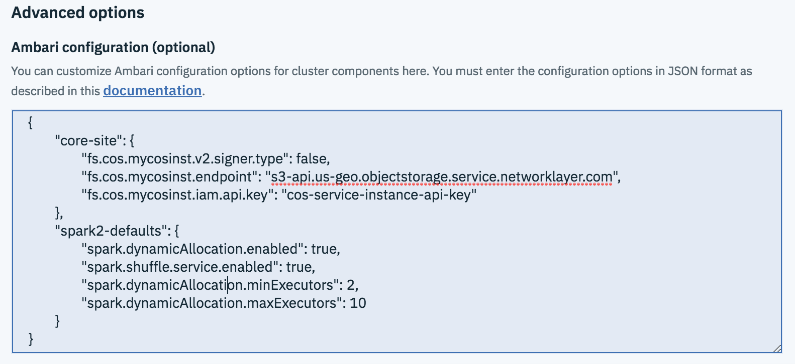

---

copyright:
  years: 2017,2018
lastupdated: "2018-09-03"

---

<!-- Attribute definitions -->
{:new_window: target="_blank"}
{:shortdesc: .shortdesc}
{:codeblock: .codeblock}
{:screen: .screen}
{:pre: .pre}

# Advanced provisioning options
{: #advanced-provisioning-options}

{{site.data.keyword.iae_full_notm}} enables advanced users to provide custom configurations which Ambari understands and uses when creating a cluster for cluster components like Hadoop, Spark, and Hive. Note that all custom configurations for Hadoop, Spark, Hive, and other cluster components must be added as part of the `ambari_config` JSON object in the `advanced_options` JSON object and the size of the `advanced_options` JSON object should not exceed 8 KB. The custom configurations must be compatible with the cluster components in the {{site.data.keyword.iae_full_notm}} software package you choose.

**Note:** During cluster creation, the `ambari_config` JSON object is taken as is and if erroneous configurations are provided can lead to runtime failures of the jobs or worse, can result in cluster creation failures.

## Creating a cluster with custom Ambari configurations using the IBM Cloud CLI

Enter the following command to create a cluster with custom configurations by using the {{site.data.keyword.Bluemix_short}} CLI:
```
bx resource service-instance-create <service instance name> ibmanalyticsengine <Plan name> <region> -p @<path to JSON file with cluster parameters> ```

The service creation JSON object has an optional `advanced_options` JSON object that hosts a nested JSON object called `ambari_config` which in turn can have one or more `config-groups` as nested JSON objects.
```
{
	"num_compute_nodes": 1,
	"hardware_config": "<hwconfig>",
	"software_package": "<ibmae-package>",
	"advanced_options": {
		"ambari_config": {
			"config-group1": {
				"<key1>": "<value1>",
				"<key2>": "<value2>",
				"<key3>": "<value3>"
			},
			"config-group2": {
				"<key1>": "<value1>",
				"<key2>": "<value2>",
				"<key3>": "<value3>"
			},
			"config-group3": {
				"<key1>": "<value1>",
				"<key2>": "<value2>",
				"<key3>": "<value3>"
			}

		}
	}
}
```

The following examples show JSON payloads for `advanced_options` with custom Ambari configurations for cluster creation.

- [Sample I. Associate Cloud Object Storage during cluster creation using AWS style authentication](#sample-i-associate-cloud-object-storage-during-cluster-creation-using-aws-style-authentication)
- [Sample II. Associate Cloud Object Storage during cluster creation using IAM Style authentication](#sample-ii-associate-cloud-object-storage-during-cluster-creation-using-iam-style-authentication)
- [Sample III. Enable dynamic resource allocation for Spark during cluster creation](#sample-iii-enable-dynamic-resource-allocation-for-spark-during-cluster-creation)
- [Sample IV. Externalize the Hive metastore to IBM Compose for MySQL during cluster creation](#sample-iv-externalize-the-hive-metastore-to-ibm-compose-for-mysql-during-cluster-creation)

## Sample I. Associate Cloud Object Storage during cluster creation using AWS style authentication

You must add the configuration properties that are relevant to Cloud Object Storage in the `core-site` config-group. In AWS style authentication, the following properties are required:
- `fs.cos.<servicename>.access.key`
- `fs.cos.<servicename>.endpoint`
- `fs.cos.<servicename>.secret.key`

Note that the value for the variable `<servicename>` can be any literal such as `instance1` or `instance2`. You can also use `<servicename>` and define multiple sets of parameters to differentiate between separate  instances of Cloud Object Storage.

```
{
	"num_compute_nodes": 1,
	"hardware_config": "default",
	"software_package": "ae-1.1-spark",
	"advanced_options": {
		"ambari_config": {
			"core-site": {
				"fs.cos.<servicename1>.access.key": "<userKey>",
				"fs.cos.<servicename1>.endpoint": "<cosEndpoint>",
				"fs.cos.<servicename1>.secret.key": "<SecretKey>",
				"fs.cos.<servicename2>.access.key": "<userKey>",
				"fs.cos.<servicename2>.endpoint": "<cosEndpoint>",
				"fs.cos.<servicename2>.secret.key": "<SecretKey>"
			}
		}
	}
}
```

## Sample II. Associate Cloud Object Storage during cluster creation using IAM style authentication

You must add the configuration properties that are relevant to Cloud Object Storage in the `core-site` config-group. In IAM style authentication, the following properties are required:

- `fs.cos.<servicename>.v2.signer.type`
- `fs.cos.<servicename>.endpoint`
- `fs.cos.<servicename>.iam.api.key` or `fs.cos.<servicename>.iam.token`

 You must specify either the api key or the token. Keep in mind that the token expires.

```
{
 "num_compute_nodes": 1,
 "hardware_config": "default",
 "software_package": "ae-1.1-spark",
 "advanced_options": {
   "ambari_config": {
     "core-site": {
       "fs.cos.<servicename>.v2.signer.type": false,
       "fs.cos.<servicename>.endpoint": "<cosEndpoint>",
       "fs.cos.<servicename>.iam.api.key": "<cosKey>"
     }
   }
 }
}
```

## Sample III. Enable dynamic resource allocation for Spark during cluster creation

Spark provides a mechanism to dynamically adjust the resources your application occupies based on the workload. The following properties must be set to enable dynamic resource allocation in the `spark2-defaults` config-group:

- `spark.dynamicAllocation.enabled`
- `spark.shuffle.service.enabled`
- `spark.dynamicAllocation.minExecutors`
- `spark.dynamicAllocation.initialExecutors`
- `spark.dynamicAllocation.maxExecutors`

  **Note:** `spark.dynamicAllocation.initialExecutors` is same as `spark.dynamicAllocation.minExecutors`.

```
{
	"num_compute_nodes": 1,
	"hardware_config": "default",
	"software_package": "ae-1.1-spark",
	"advanced_options": {
		"ambari_config": {
			"spark2-defaults": {
				"spark.dynamicAllocation.enabled": true,
				"spark.shuffle.service.enabled": true,
				"spark.dynamicAllocation.minExecutors": < x > ,
				"spark.dynamicAllocation.maxExecutors": < y >
			}
		}
	}
}
```
**Note:** Values for `<x>`  and `<y>` can be specified based on the hardware configuration of the compute node and job requirements.

## Sample IV. Externalize the Hive metastore to IBM Compose for MySQL during cluster creation

To create a cluster with an external Hive metastore, you must provide the following properties in the `hive-site` config-group:
- `javax.jdo.option.ConnectionURL`
- `javax.jdo.option.ConnectionUserName`
- `javax.jdo.option.ConnectionPassword`
- `ambari.hive.db.schema.name`

 For details on JDBC connection format for  {{site.data.keyword.composeForMySQL}}, see [Externalizing the Hive metastore to IBM Compose for MySQL](./working-with-hive.html#externalizing-the-hive-metastore-to-ibm-compose-for-mysql).

```
{
	"num_compute_nodes": 1,
	"hardware_config": "default",
	"software_package": " ae-1.1-hadoop-spark ",
	"advanced_options": {
		"ambari_config": {
			"hive-site": {
				"javax.jdo.option.ConnectionURL": "<jdbcUrl>",
				"javax.jdo.option.ConnectionUserName": "<mysqlUname>",
				"javax.jdo.option.ConnectionPassword": "<mysqlPassword>",
				"ambari.hive.db.schema.name": "hiveDBName"
			}
		}
	}
}
```

## Creating a cluster with custom Ambari configurations using the IBM  Cloud console
{: #ambari-configuration-in-provisioning-ui}

When you create an {{site.data.keyword.iae_short}} service instance by using the {{site.data.keyword.Bluemix_short}} console, you can specify custom Ambari configurations in the service configuration page.

You can specify the configuration parameters in a JSON object in the field named `Ambari configuration` under the section `Advanced options`. The JSON object must be a map of the Ambari configuration groups, like the values you can specify for `advanced_options.ambari_config` shown in the previous CLI examples.

For example:


