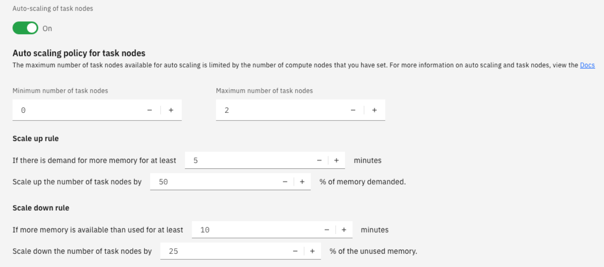

---

copyright:
  years: 2017, 2021
lastupdated: "2021-03-18"

subcollection: AnalyticsEngine

---

<!-- Attribute definitions -->
{:new_window: target="_blank"}
{:shortdesc: .shortdesc}
{:codeblock: .codeblock}
{:screen: .screen}
{:pre: .pre}
{:note: .note}
{:important: .important}
{:external: target="_blank" .external}

# Auto scaling clusters
{: #autoscaling-clusters}

It is not always possible to estimate the right number of nodes required in a cluster to run applications. To assist you in this situation, you can create an {{site.data.keyword.iae_short}} cluster with auto scaling that will automatically scale nodes up or down in the cluster based on the amount of memory demanded by the applications.

You can enable auto scaling on an {{site.data.keyword.iae_short}}  cluster by provisioning a cluster with an auto scaling policy. With an auto scaling policy, you define the cluster's scaling boundaries and the scale up and scale down rule.

Only tasks nodes in the clusters can be scaled up or scaled down automatically. Automatic scaling is not supported for compute nodes.
{: important}

## Provisioning with auto scaling

The way you provision an {{site.data.keyword.iae_short}} cluster with auto scaling is similar to the way you provision a cluster without auto scaling, with just one difference. Instead of specifying an absolute number of task nodes in the provisioning request, you specify an auto scaling policy.

You can create an {{site.data.keyword.iae_short}} cluster with auto scaling by using the:

- {{site.data.keyword.Bluemix_short}} user interface

  You can specify the auto scaling policy on the cluster configuration page.

  
- {{site.data.keyword.Bluemix_short}} CLI

  You can provision a cluster with auto scaling using the CLI by following the steps defined in [Creating a service instance using the IBM Cloud command-line interface](/docs/AnalyticsEngine?topic=AnalyticsEngine-provisioning-IAE#creating-a-service-instance-using-the-ibm-cloud-command-line-interface).

  This is a sample payload with an auto-scaling cluster specification:
  ```
  {
    "num_compute_nodes": "3",
    "hardware_config": "default",
    "software_package": "ae-1.2-hive-spark",
    "autoscale_policy": {
      "task_nodes": {
        "num_min_nodes": 1,
        "num_max_nodes": 10,
        "scaleup_rule": {
          "sustained_demand_period_minutes": "10",
          "percentage_of_demand": "50"
        },
        "scaledown_rule": {
          "sustained_excess_period_minutes": "20",
          "percentage_of_excess": "25"
        }
      }
    }
  }
  ```
- Resource Controller API

  You can provision a cluster with auto scaling using the Resource Controller API by following the steps defined in [Creating a service instance using the Resource Controller REST API](/docs/AnalyticsEngine?topic=AnalyticsEngine-provisioning-IAE#creating-a-service-instance-using-the-resource-controller-rest-api).

  This is a sample payload with an auto-scaling cluster specification:
  ```
  {
    "name": "MyServiceInstance",
    "resource_plan_id": "3175a5cf-61e3-4e79-aa2a-dff9a4e1f0ae",
    "resource_group_id": "XXXXX",
    "region_id": "us-south",
    "parameters": {
      "num_compute_nodes": "2",
      "hardware_config": "default",
      "software_package": "ae-1.2-hive-spark",
      "autoscale_policy": {
        "task_nodes": {
          "num_min_nodes": 1,
          "num_max_nodes": 10,
          "scaleup_rule": {
            "sustained_demand_period_minutes": "10",
            "percentage_of_demand": "50"
          },
          "scaledown_rule": {
            "sustained_excess_period_minutes": "20",
            "percentage_of_excess": "25"
          }
        }
      }
    }
  }
  ```

## Understand the auto scaling policy

When you provision a cluster with auto scaling using the settings in the above examples, this is how you read the auto scaling policy:

- The number of task nodes in the cluster are scaled up or down depending on the memory demands of the running applications, but within the boundary specified by the `num_min_nodes` and `num_max_nodes` attributes. Irrespective of how much memory the applications demand, the cluster will never be scaled up beyond 10 task nodes.
- `scaleup_rule`: The {{site.data.keyword.iae_short}} auto scaler will start scaling up if there is a demand for more memory for at least 10 minutes, specified in the  `sustained_demand_period_minutes` attribute. The task nodes are scaled up by 50 % of the memory demanded, specified in the  `percentage_of_demand` attribute.
- `scaledown_rule`: The {{site.data.keyword.iae_short}} auto scaler will start scaling down if more memory is available than is needed for more than 20 minutes, specified in the  `sustained_excess_period_minutes` attribute. The task nodes are scaled down by 25 % of the unused memory, specified in the `percentage_of_excess` attribute.


You can't edit the auto scaling policy of a cluster after it was created. If you made a mistake when you created the policy, you should delete the cluster and create a new one with a correct policy. Auto scaling is not supported in the Lite plan.
{: important}
