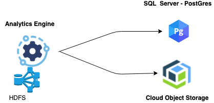

---

copyright:
  years: 2017, 2021
lastupdated: "2021-03-31"

subcollection: AnalyticsEngine

---

<!-- Attribute definitions -->
{:new_window: target="_blank"}
{:shortdesc: .shortdesc}
{:codeblock: .codeblock}
{:screen: .screen}
{:note: .note}
{:pre: .pre}

# Best practices
{: #best-practices}

You should use the {{site.data.keyword.iae_full_notm}} cluster as a compute-only engine. Ideally, you should not store any data on the cluster; you should try to keep the cluster as stateless as possible. This deployment model is recommended so that you can delete and create clusters often to either save on costs, pick up new features, or work with new packages.

The following types of data stored on a cluster contribute towards making the cluster stateful and should preferably not be stored on the cluster:
- Data you want to analyze, and any results of your analysis
- Metadata
- Jobs with Spark, Hadoop, or Hive queries
- Any customization, for example, Spark or Hadoop configuration settings, or Python, R, Scala, or Java libraries.

To help you create and maintain a stateless cluster, you should try to keep to the following recommended best practices. The best practices include choosing the correct plan and selecting the appropriate configuration options:

- [Separate compute from storage](#separate-compute-from-storage)
- [Choose the right Databases for PostgreSQL configuration](#postgre-config)
- [Choose the right {{site.data.keyword.cos_full_notm}} configuration](#encryption)
    - [Disaster Recovery Resiliency](#DR-resiliency)
    - [Encryption](#cos-encryption)
    - [{{site.data.keyword.cos_full_notm}} credentials](#cos-credentials)
    - [Private endpoints for {{site.data.keyword.cos_full_notm}}](#private-endpoint)
- [Create a new cluster for new features or packages](#new-packages)
- [Customize cluster creation using scripts](#use-scripts)
- [Size the cluster appropriately](#cluster-size)
- [Choose the right plan](#plan)
- [Choose the appropriate hardware configuration](#hardware)
- [Choose the appropriate software package](#software)
- [Tune kernel settings for Spark interactive jobs](#tune-kernel-for-spark-interactive)
- [Store temporary files on cluster prudently](#store-temp-files)
- [Configure the cluster for log monitoring and troubleshooting](#configure-log-monitoring)
- [Switch regions for disaster recovery](#disaster-recovery)

## Separate compute from storage
{: #separate-compute-from-storage}

Although the {{site.data.keyword.iae_full_notm}} cluster includes the Hadoop component with HDFS running on the compute nodes, you should use {{site.data.keyword.cos_full_notm}} as the primary data store. You should use the HDFS nodes only as a data store for sandbox-type workloads.

{{site.data.keyword.iae_full_notm}} can be configured to work with [data in {{site.data.keyword.cos_full_notm}}](/docs/AnalyticsEngine?topic=AnalyticsEngine-config-cluster-cos) and with [Hive metadata stored in IBM Cloud Databases for PostgreSQL](/docs/AnalyticsEngine?topic=AnalyticsEngine-working-with-hive#externalizing-hive-metastore). In this way, both data and metadata reside outside of the cluster. When jobs are executed, they run on the compute nodes by bringing in data (as required by the job plan) from {{site.data.keyword.cos_short}}. Note that the application binaries can reside in {{site.data.keyword.cos_short}} as well.

## Choose the right Databases for PostgreSQL configuration
{: #postgre-config}

### Use private endpoints when creating an instance of Databases for PostgreSQL
{: #private-postgre-endpoints}

Make sure you choose **Private Network** for the endpoints when you create the Databases for PostgreSQL instance. Using private endpoints increases performance and is more cost effective. See [Cloud service endpoints integration](/docs/AnalyticsEngine?topic=AnalyticsEngine-service-endpoint-integration).

### Use new instance of PostgreSQL between `AE` cluster versions
{: #new-metastore-instance}

You should use a different IBM Cloud Databases for PostgreSQL  instance to store Hive metadata when you migrate to a new {{site.data.keyword.iae_full_notm}} cluster version. The Hive metastore schema changes between versions of `AE`. Therefore you should manually recreate the Hive metadata in a new instance of Cloud Databases for PostgreSQL to avoid migration related issues.

## Choose the right {{site.data.keyword.cos_full_notm}}  configuration
{: #encryption}

Consider the following configuration aspects:

### Disaster Recovery (DR) Resiliency
{: #DR-resiliency}

You should use the IBM COS Cross Regional resiliency option that backs up your data across several different cities in a region. In contrast, the Regional resiliency option back ups data in a single data center. See the [{{site.data.keyword.cos_full_notm}}  documentation.](/docs/cloud-object-storage/info?topic=cloud-object-storage-endpoints#endpoints)

### Encryption
{: #cos-encryption}

{{site.data.keyword.cos_full_notm}} comes with default built-in encryption. You can also configure {{site.data.keyword.cos_short}} to work with the BYOK Key Protect service. See [Getting started with encryption keys](/docs/key-protect?topic=key-protect-getting-started-tutorial#getting-started-tutorial) for more information. Note however that Key Protect is currently only supported for regional buckets. See the [{{site.data.keyword.cos_short}} manage encryption](/docs/cloud-object-storage/basics?topic=cloud-object-storage-encryption#encryption) documentation.

### {{site.data.keyword.cos_full_notm}} credentials
{: #cos-credentials}

By default, {{site.data.keyword.cos_full_notm}} uses IAM-style credentials. If you want to work with AWS-style credentials, you need to provide the inline configuration parameter `{"HMAC":true}` as shown in [Service credentials](/docs/cloud-object-storage/iam?topic=cloud-object-storage-service-credentials#service-credentials).

### Private endpoints for {{site.data.keyword.cos_full_notm}}
{: #private-endpoint}

Private endpoints provide better performance and do not incur charges for any outgoing or incoming bandwidth even if the traffic is across regions or across data centers. Whenever possible, you should use a private endpoint.

## Create a new cluster for new features or packages
{: #new-packages}

Upgrading components on the  {{site.data.keyword.iae_full_notm}} cluster to a higher version is not supported. If you want to include a new feature, a new package, or a fix, you should delete the old cluster and create a new one. The earlier reference to separating compute from storage will have a bearing on this best practice as well. If you separate the data from compute, then it is easier for you to delete an existing cluster and create a new one from where you can run your jobs again. This is also the recommended deployment pattern if you want your input and output data (as a result of the job execution) to be accessible even after the cluster is deleted.

## Customize cluster creation using scripts
{: #use-scripts}

To enable deleting and creating clusters often, you should use customization scripts to configure your cluster, and to install custom libraries and packages. This way, you won't have to manually customize the cluster every time you create a new one.

If you store your customization scripts in {{site.data.keyword.cos_short}}, make sure that the buckets and access credentials for the scripts are different from the buckets and access credentials for your application or business data.

See [Customizing a cluster](/docs/AnalyticsEngine?topic=AnalyticsEngine-cust-cluster).

If your customization consists only of changes to the configuration of a cluster component, for example changes to the `core-site.xml` file of the HDFS component, the `spark-defaults.conf` file of the Spark component, or the `hive-site.xml` of Hive, it is easier and more efficient to add these changes as [Advanced provisioning options](/docs/AnalyticsEngine?topic=AnalyticsEngine-advanced-provisioning-options) during cluster creation than to add the configuration changes to a customization script. You should use a customization script for installing libraries and packages.
{: note}

## Size the cluster appropriately
{: #cluster-size}

Size your cluster depending on your environment and workload:

- For your development environment, create an {{site.data.keyword.iae_full_notm}} cluster  with 1 Management and 2 compute nodes
- For your staging environment, the cluster size depends on the workloads and job characteristics, as well as the service-level agreement (SLA).
- For Production environment, the cluster size depends on the workloads and job characteristics, and your SLA. Contact IBM Sales to get suitable sizing for your requirements.

In general, it is advisable to have at least 2 nodes in the cluster so that replication can be done internally by Hadoop for HDFS binaries and data if any.

### Choosing between task and compute nodes
{: #task-compute}

Task nodes don't run HDFS hence they are more stateless in  nature, which makes them more suitable for clusters that require frequent scaling up and down. For production clusters, we recommend having at least two compute nodes and using task nodes, which can be scaled up or scaled down as needed.

## Choose the right plan
{: #plan}

Select the plan based on your workload use-case:
- For deploy, run and discard use-cases, select hourly plan clusters.
- For long running clusters, select monthly plan clusters.

## Choose the appropriate hardware configuration
{: #hardware}

For running heavy batch parallel Hadoop/Spark jobs that require more memory and generate more intermediate data, choose the memory-intensive node size. Also, if you want to run many concurrent notebooks (more than two) from {{site.data.keyword.DSX}} in {{site.data.keyword.iae_full_notm}}, you should select the memory-intensive node size and not the default node size.

## Choose the appropriate software package
{: #software}

The software packages on `AE 1.2` clusters include components for Horton Dataworks Platform 3.1.

| AE 1.2  clusters     | Based on HDP 3.1        |
|-----------------|-----------------------------|
| `AE 1.2 Hive LLAP`  \nChoose if you are planning to run Hive in interactive mode, with preconfigured settings for Hive LLAP for faster responses. | Hadoop, Livy, Knox, Ambari, Conda-Py, Hive (LLAP mode) |
| `AE 1.2 Spark and Hive`  \nChoose if you are planning to run Hive and/or Spark workloads.  | Hadoop, Livy, Knox, Spark, JEG, Ambari, Conda Py, Hive (non LLAP mode ) |
| `AE 1.2 Spark and Hadoop`  \nChoose if you are planning to run Hadoop workloads in addition to Spark workloads. | (AE 1.2 Spark and Hive) + HBase, Phoenix, Oozie |

Currently you cannot resize a cluster that uses the `AE 1.2 Hive LLAP` software package.
{: note}

## Tune kernel settings for Spark interactive jobs
{: #tune-kernel-for-spark-interactive}

When running large Spark interactive jobs, you might need to adjust kernel settings to tune resource allocation. To get the maximum performance from your cluster for a Spark job, make sure the kernel settings for memory and executor are correct. See [Kernel settings](/docs/AnalyticsEngine?topic=AnalyticsEngine-kernel-settings).

## Store temporary files on the cluster prudently
{: #store-temp-files}

Although you should use {{site.data.keyword.cos_full_notm}} as your primary storage for all data files and job binaries, you might want to create and store some temporary data or files on the cluster itself. If you need to do that, you can store this data under the `/home/wce/clsadmin` directory on any of the nodes of the cluster. Note that you have about 20 GB capacity under `/home` across all the three management nodes. However, you should not use more than 80% of this total capacity so as to not disrupt the normal functioning on the cluster. You should avoid saving data under the `/tmp` directory because this space is used as the scratch directory for job execution.

Data stored on the cluster is not persistent outside the cluster lifecycle. If the cluster is deleted, the data will be expunged too. So make sure you backup any important data you store on the cluster.
{: note}

## Configure the cluster for log monitoring and troubleshooting
{: #configure-log-monitoring}

To facilitate monitoring and troubleshooting your applications and jobs, you can configure your cluster for log monitoring and analysis by aggregating your {{site.data.keyword.iae_full_notm}}  cluster and job logs to a centralized {{site.data.keyword.la_short}} server of your choice. See [Configuring log aggregation](/docs/AnalyticsEngine?topic=AnalyticsEngine-log-aggregation).

By configuring log aggregation, you can externalize the log files, which means that these files can be accessed even after the cluster was deleted.

When you configure {{site.data.keyword.iae_full_notm}} to work with the {{site.data.keyword.la_full_notm}} instance, we encourage you to select to connect to the private endpoints of the instance, to increase performance and save costs. See [Configuring private endpoints](/docs/Log-Analysis-with-LogDNA?topic=Log-Analysis-with-LogDNA-endpoints).

## Switch regions for disaster recovery
{: #disaster-recovery}

You can create {{site.data.keyword.iae_full_notm}} service instances in different regions, for example, in the US South, the United Kingdom, Germany, and Japan. In the event that you cannot create a service instance in one region, you can switch to an alternate region which hosts  {{site.data.keyword.iae_full_notm}}. You will not be able to access any existing clusters from the new region. However, creating a new cluster in a new region should not be a problem if you followed the recommended best practices described in this topic and kept your existing cluster as stateless as possible with data and jobs residing outside the cluster.

See the [list of supported regions and the endpoints to use](/docs/AnalyticsEngine?topic=AnalyticsEngine-provisioning-IAE#creating-a-service-instance-using-the-ibm-cloud-command-line-interface) or refer to the {{site.data.keyword.Bluemix_short}} catalog for {{site.data.keyword.iae_full_notm}}.
