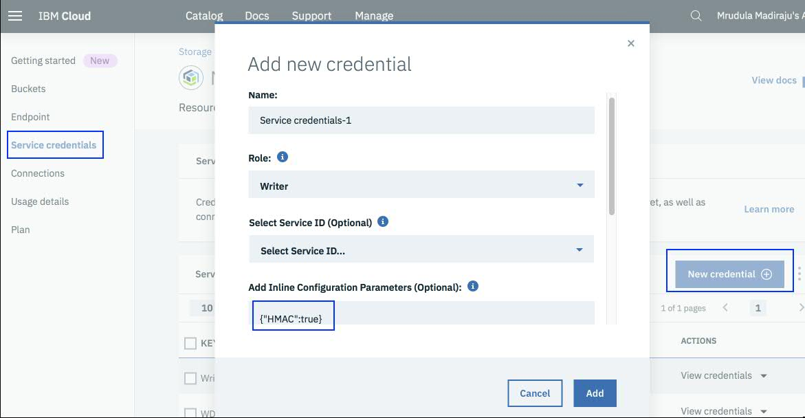

---

copyright:
  years: 2017, 2019
lastupdated: "2019-07-22"

subcollection: AnalyticsEngine

---

<!-- Attribute definitions -->
{:new_window: target="_blank"}
{:shortdesc: .shortdesc}
{:codeblock: .codeblock}
{:screen: .screen}
{:pre: .pre}

# Working with {{site.data.keyword.cos_short}}
{: #config-cluster-cos}

{{site.data.keyword.cos_full_notm}} is a highly scalable cloud storage service, designed for high durability, resiliency and security. See [{{site.data.keyword.cos_full_notm}}](/docs/services/cloud-object-storage?topic=cloud-object-storage-about#about).

This topic explains how to configure an {{site.data.keyword.iae_full_notm}} cluster to connect to data and applications stored in {{site.data.keyword.cos_short}}.

You should use {{site.data.keyword.cos_full_notm}} as your primary data source and sink as described in [Best Practices](/docs/services/AnalyticsEngine?topic=AnalyticsEngine-best-practices). Not only the data itself, but also your application or job binaries, for example Spark Python files or Yarn application JARs, should reside in {{site.data.keyword.cos_short}}. By removing all data from the cluster, you make your cluster stateless, which gives you the flexibility to spin up new {{site.data.keyword.iae_full_notm}} clusters as you need them. See [Choose the right {{site.data.keyword.cos_short}} Storage configuration](/docs/services/AnalyticsEngine?topic=AnalyticsEngine-best-practices#encryption).

To work with {{site.data.keyword.cos_short}} in an {{site.data.keyword.iae_full_notm}} cluster:

1. Provision an {{site.data.keyword.cos_short}} service instance in {{site.data.keyword.Bluemix_short}}. See [Creating a new service instance](/docs/services/cloud-object-storage/iam?topic=cloud-object-storage-provision).

  Create an {{site.data.keyword.Bluemix_short}} bucket in the  region of your choice and select the configuration, such as  resiliency (regional or cross-regional), and storage volume and price. See [Creating buckets to store your data](/docs/services/cloud-object-storage/iam?topic=cloud-object-storage-getting-started).

  Make a note of the bucket name that you created. You will need it later when you configure {{site.data.keyword.iae_full_notm}} to work with {{site.data.keyword.cos_short}}.
1. [Get the {{site.data.keyword.cos_short}} credentials](/docs/services/AnalyticsEngine?topic=AnalyticsEngine-get-cos-credentials).
1. [Determine the {{site.data.keyword.cos_short}} credentials for {{site.data.keyword.iae_full_notm}}](/docs/services/AnalyticsEngine?topic=AnalyticsEngine-cos-credentials-in-iae).
1. [Configure {{site.data.keyword.iae_full_notm}} to use {{site.data.keyword.cos_short}}](/docs/services/AnalyticsEngine?topic=AnalyticsEngine-configure-iae-with-cos).
1. [Access objects in {{site.data.keyword.cos_short}}](/docs/services/AnalyticsEngine?topic=AnalyticsEngine-access-objs-in-cos).


<!--
## Getting the {{site.data.keyword.cos_short}} credentials

To use {{site.data.keyword.cos_full_notm}} as your primary data source:

1. Provision an {{site.data.keyword.cos_full_notm}} service instance from the {{site.data.keyword.Bluemix_short}} catalog.
1. Get the credentials to your newly created {{site.data.keyword.cos_short}} service instance:
  1. Click **Service Credentials** in the navigation pane.
  1. Click **New Credential** button and choose the desired options. By default, {{site.data.keyword.cos_short}} uses [IAM-style](/docs/services/cloud-object-storage?topic=cloud-object-storage-iam#iam)  credentials. If you want to work with HMAC-style credentials, you need to provide the inline configuration parameter {"HMAC":true}.

    

## What are the {{site.data.keyword.cos_short}} access credentials

After you created an {{site.data.keyword.cos_short}} service instance and when you view the credentials, you will see something like what is shown in the following example:

```
{
  "apikey": "asdf1234asdf1234asdf1234asdf1234asdf1234",
  "cos_hmac_keys": {
    "access_key_id": "aaaa1111bbbbb222222ccccc3333333ddddd44444",
    "secret_access_key": "ZZZZYYYYYXXXXXXWWWWWVVVVVVUUUUU"
  },
  "endpoints": ...
}
```
- **API keys**  

 In the example, `apikey` is the IAM API key. IBM IAM authentication using IAM API keys or IAM tokens gives you fine grained control over user access to {{site.data.keyword.cos_short}} buckets. See [Getting started with IAM](/docs/services/cloud-object-storage?topic=cloud-object-storage-iam#iam).

- **COS HMAC keys**

 In the example, the access key and secret key can be used for traditional HMAC-style access.

- **Service endpoints**

 To access the {{site.data.keyword.cos_full_notm}} service instance from {{site.data.keyword.iae_full_notm}} you need the endpoint. See [Selecting endpoints](https://ibm-public-cos.github.io/crs-docs/endpoints) for help on which endpoints you need to use based on your {{site.data.keyword.cos_short}} bucket type, such as regional versus cross-regional.

 You can also view the endpoints across regions by clicking **Endpoint** in the navigation pane of the {{site.data.keyword.cos_full_notm}}  service instance page. Always choose the **private** endpoint. Using the public endpoint is slower and more expensive. An example of an endpoint URL is:

 ```s3-api.us-geo.objectstorage.service.networklayer.com ```

## {{site.data.keyword.cos_full_notm}} access styles

{{site.data.keyword.cos_full_notm}} authentication and endpoint information must be configured in {{site.data.keyword.iae_full_notm}} to enable integration with all components. You can select to authenticate using either the IAM or HMAC style, or you can combine both styles.

### HMAC key style

Using the HMAC style credentials is like having root access to the {{site.data.keyword.cos_short}}. If you are using {{site.data.keyword.iae_full_notm}} in a single-user mode, you can use this form of authentication.

For HMAC style authentication, you must define the following parameters in {{site.data.keyword.iae_full_notm}}:
```
fs.cos.<servicename>.access.key=<Access Key ID>
fs.cos.<servicename>.endpoint=<EndPoint URL>
fs.cos.<servicename>.secret.key=<Secret Access Key>
```
The value for `<servicename>` can be any literal such as `awsservice` or `myobjectstore`. `<servicename>` is used primarily to distinguish between the different {{site.data.keyword.cos_short}} instances that are configured. For example, if you want to work with more than one {{site.data.keyword.cos_short}}, you can use service names to distinguish between them.

### IAM API key style

Using the IAM API key credentials is also like having root access to the {{site.data.keyword.cos_short}}. If you are using {{site.data.keyword.iae_full_notm}} in a single-user mode, you can use this form of authentication.

For IAM API key style authentication, you must define the following parameters in {{site.data.keyword.iae_full_notm}}:
```
fs.cos.<servicename>.v2.signer.type=false  
fs.cos.<servicename>.endpoint=<EndPoint URL>
fs.cos.<servicename>.iam.api.key=<IAM API Key>
```
Note that the signer parameter must always be set to false.

### IAM token style

If you are an administrator and want finer grained control across multiple users, you should use IAM token authentication. With IAM token style, you can enable access to the {{site.data.keyword.cos_short}} instance for selected users who then use their IAM token for runtime access. See [Inviting users and assigning access](/docs/services/cloud-object-storage?topic=cloud-object-storage-service-credentials#service-credentials).

Bear in mind that the token expires in an hour which means that it is better to specify it at runtime rather than to define it in the core-site.xml file.

For IAM token authentication, you must define the following parameter in {{site.data.keyword.iae_full_notm}}:

```
fs.cos.<servicename>.iam.token=<IAM-token-example-2342342sdfasf34234234asf……..
```
The IAM token for each user is obtained by using the `ibmcloud iam oauth-tokens` command. See [Retrieving IAM access tokens](/docs/services/AnalyticsEngine?topic=AnalyticsEngine-retrieve-iam-token).

## {{site.data.keyword.cos_short}} access configuration methods

To enable an application to connect to {{site.data.keyword.cos_short}}, you must update the cluster configuration file `core-site.xml` to include the {{site.data.keyword.cos_short}} access credentials and other values. These values must be added to the `core-site.xml` file as a set of key/value pairs.

You can configure the access to {{site.data.keyword.cos_short}} by using one of the following methods:

* [Configure access to {{site.data.keyword.cos_short}} when creating the {{site.data.keyword.iae_full_notm}} service instance ](/docs/services/AnalyticsEngine?topic=AnalyticsEngine-advanced-provisioning-options).

 This is the preferred and most efficient method.
* [Configure access to {{site.data.keyword.cos_short}} at runtime](/docs/services/AnalyticsEngine?topic=AnalyticsEngine-specify-props-runtime)
* [Configure access to {{site.data.keyword.cos_short}} using a script](/docs/services/AnalyticsEngine?topic=AnalyticsEngine-cust-cluster-script)
* [Configure access to {{site.data.keyword.cos_short}} using the Ambari UI after the {{site.data.keyword.iae_full_notm}} service instance was created](/docs/services/AnalyticsEngine?topic=AnalyticsEngine-config-cos-ambari)

## Accessing objects in {{site.data.keyword.cos_short}}

After you have configured {{site.data.keyword.iae_full_notm}} to work with {{site.data.keyword.cos_short}} by using one of the access configuration methods, you can start accessing objects in {{site.data.keyword.cos_short}} from Spark, Hive, or HDFS.

To access data objects in an {{site.data.keyword.cos_short}} bucket, use the following URI:
```
cos://<bucket_name>.<servicename>/<object_name>```

For example:
```
cos://mybucket.myprodservice/detail.txt```


For examples of how to upload data to or download data from {{site.data.keyword.cos_short}}, see [Data movement on {{site.data.keyword.cos_full_notm}}](/docs/services/AnalyticsEngine?topic=AnalyticsEngine-#data-movement-cos).-->
