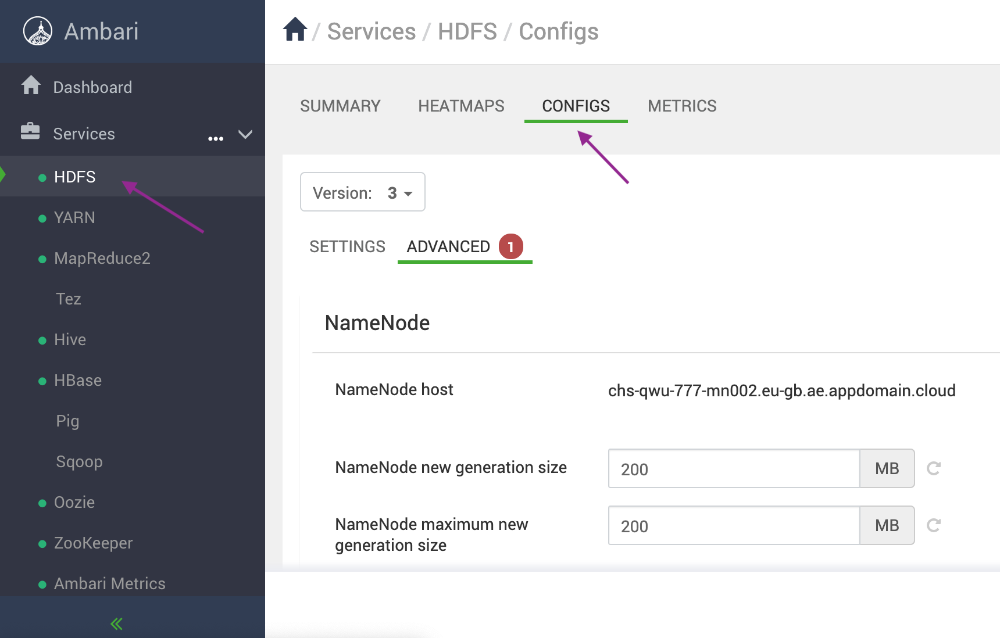
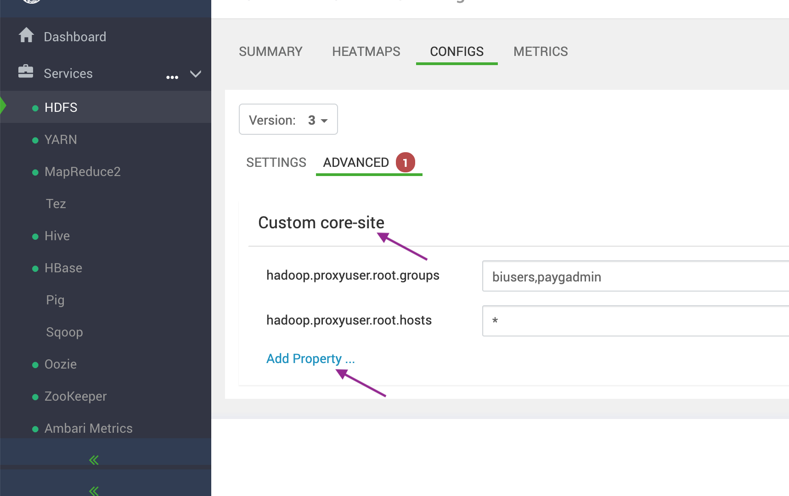
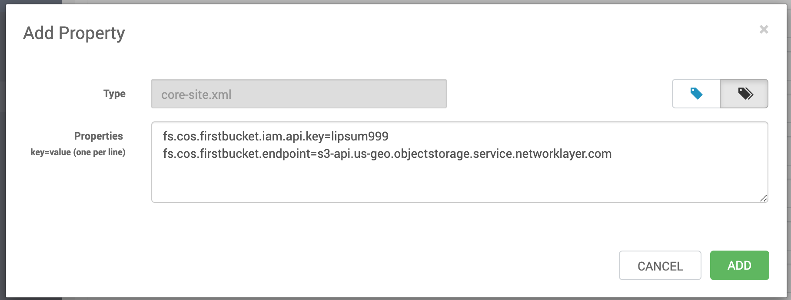
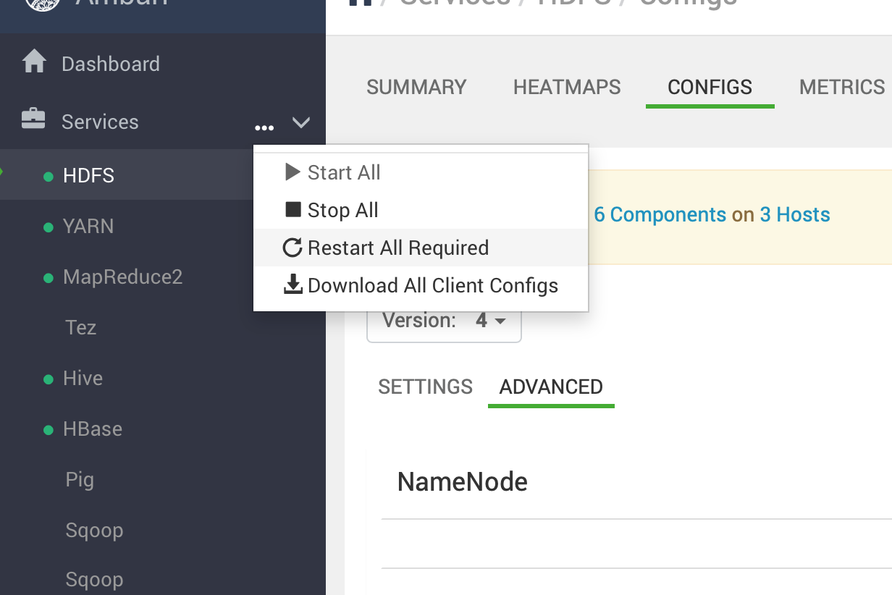

---

copyright:
  years: 2017, 2021
lastupdated: "2021-01-04"

subcollection: AnalyticsEngine

---

<!-- Attribute definitions -->
{:new_window: target="_blank"}
{:shortdesc: .shortdesc}
{:codeblock: .codeblock}
{:screen: .screen}
{:pre: .pre}

# Configure a Cloud Object Storage connection through Ambari
{: #config-cos-ambari}

You can configure the cluster to access data objects in IBM Cloud Object Storage by using the Ambari UI. In Ambari, you can add  properties and values to the core-site.xml file on your cluster instance.

1. Open the Ambari console, and then, on the dashboard, click **HDFS** > **Configs** > **Advanced** to see the advanced configuration options for  HDFS. 

 
2. Scroll down the page until you see `Custom core-site` and click **Add Property**.

 

3. Enter the desired properties in the Properties field and then click **Add** to save your changes. For information about which properties to add, see [Authentication parameters to Cloud Object Storage](/docs/AnalyticsEngine?topic=AnalyticsEngine-cos-credentials-in-iae).

 
4. Ambari indicates which services need to be restarted. Click **Restart All Required** to restart all services affected by your  changes.

 
5. Verify the configuration by running a few housekeeping commands. See [Useful Object Storage housekeeping commands](/docs/AnalyticsEngine?topic=AnalyticsEngine-data-movement-cos#useful-object-storage-housekeeping-commands).
