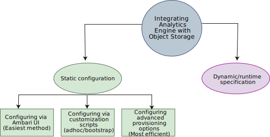

---

copyright:
  years: 2017, 2019
lastupdated: "2019-07-16"

subcollection: AnalyticsEngine

---

<!-- Attribute definitions -->
{:new_window: target="_blank"}
{:shortdesc: .shortdesc}
{:codeblock: .codeblock}
{:screen: .screen}
{:pre: .pre}

# Configuring {{site.data.keyword.iae_full_notm}} to work with {{site.data.keyword.cos_short}}
{: #configure-iae-with-cos}

In {{site.data.keyword.iae_full_notm}}, you can work with  applications and their dependent data, or with files that reside in {{site.data.keyword.cos_short}}. For {{site.data.keyword.iae_full_notm}} to work with  {{site.data.keyword.cos_short}}, it needs the {{site.data.keyword.cos_short}} credentials. There are two ways to configure the {{site.data.keyword.cos_short}} credentials in {{site.data.keyword.iae_full_notm}} as shown in the following diagram:

- In a **static** configuration, the credential parameters are added to the `core-site.xml` configuration file of the HDFS component. There are 3 ways to pre-configure the cluster. See [Static configuration options](#static-configuration-options).
- In a **dynamic or runtime** configuration, the credential parameters are specified as part of the Spark or Hadoop job. See [Specifying parameters at runtime](/docs/AnalyticsEngine?topic=AnalyticsEngine-specify-props-runtime).

## Static configuration options

There are 3 ways to pre-configure the cluster before runtime:

- By using the Ambari UI

    The easiest and most intuitive way to add the credentials is by using the Ambari UI. This is a good method for newbie users or for you to quickly try out the integration. However, this involves restarting services and, if you have more than one cluster, you have to repeat the procedure manually on each cluster. See [Configure an {{site.data.keyword.cos_short}} connection through Ambari](/docs/AnalyticsEngine?topic=AnalyticsEngine-config-cos-ambari).
- By using customization scripts

    If you want to apply the same customization on every cluster that you create, you should extrapolate the customizations into a shell script. This way, the customization effort on a cluster isn't manual, and the customization steps are consistent. You can use either adhoc or bootstrap customization. Bootstrap is more efficient because the customization is applied during cluster creation and no services need to be restarted. See [Using customization scripts](/docs/AnalyticsEngine?topic=AnalyticsEngine-cust-cluster). The customization commands in the script involve calling Ambari scripts. See [Sample of a customization script](/docs/AnalyticsEngine?topic=AnalyticsEngine-cust-cluster-script).
- By advanced provisioning

    If you don’t want to use a configuration script, you can provide the credential parameters as key-value pairs in the cluster creation JSON payload. This is the most efficient and repeatable way to configure the cluster credentials. See [Adding the credentials as key-value pairs](/docs/AnalyticsEngine?topic=AnalyticsEngine-advanced-provisioning-options#sample-ii-associate-cloud-object-storage-during-cluster-creation-using-iam-style-authentication).
