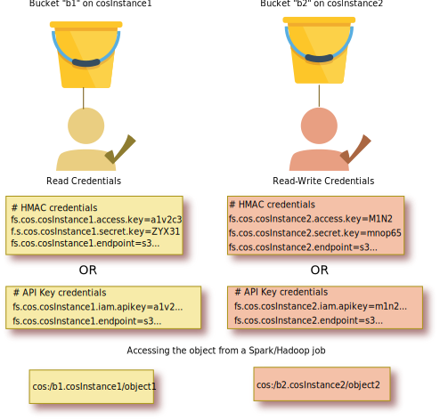

---

copyright:
  years: 2017, 2022
lastupdated: "2022-02-28"

subcollection: AnalyticsEngine

---

<!-- Attribute definitions -->
{:new_window: target="_blank"}
{:shortdesc: .shortdesc}
{:codeblock: .codeblock}
{:screen: .screen}
{:pre: .pre}

# Understanding the {{site.data.keyword.cos_short}} credentials
{: #cos-credentials-in-iae-serverless}

{{site.data.keyword.cos_full_notm}} access credentials are configured as key-value pair parameters in {{site.data.keyword.iae_full_notm}}.
These parameters start with the prefix `fs.cos.` followed by an identifier, which you can define, and end with the name of the credential.

Note that you can configure one {{site.data.keyword.iae_full_notm}} service instance to work with multiple {{site.data.keyword.cos_short}} instances or multiple {{site.data.keyword.cos_short}} credentials. To differentiate between the different sets of credentials, you use separate identifiers or literals, which you can defined.

The following diagram shows how the {{site.data.keyword.cos_short}} credentials are used in {{site.data.keyword.iae_full_notm}}.



The diagram shows two {{site.data.keyword.cos_short}} instances with two different data buckets `b1` and `b2`. To distinguish between the two instances, two identifiers are used, `cosInstance1` and `cosInstance2`. Note that the bucket names (`b1` and `b2`) that you use must be the actual names of the existing buckets in {{site.data.keyword.cos_short}}. You can only choose the name of the identifier so that you can distinguish between {{site.data.keyword.cos_short}} instances.

## Structure of HMAC credentials
For HMAC style authentication, you must define the following parameters in {{site.data.keyword.iae_full_notm}}:
```
fs.cos.<identifier>.access.key=<Access Key ID>
fs.cos.<identifier>.endpoint=<EndPoint URL>
fs.cos.<identifier>.secret.key=<Secret Access Key>
```

Note that the endpoint URL has the format `s3.direct.us.cloud-object-storage.appdomain.cloud` and doesn't require the prefix `https://`.

## Structure of API key credentials

For IAM API key style authentication, you must define the following parameters in {{site.data.keyword.iae_full_notm}}:
```
fs.cos.<identifier>.iam.api.key=<IAM API Key>
fs.cos.<identifier>.endpoint=<EndPoint URL>
```

Like for HMAC credentials, the endpoint URL has the format `s3.direct.us.cloud-object-storage.appdomain.cloud` and doesn't require the prefix `https://`.
