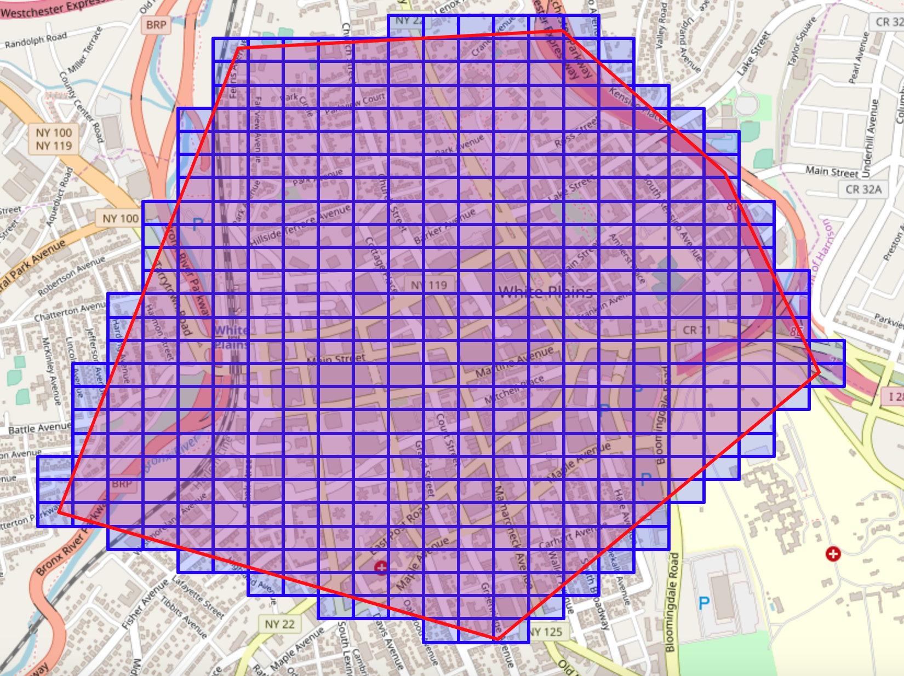
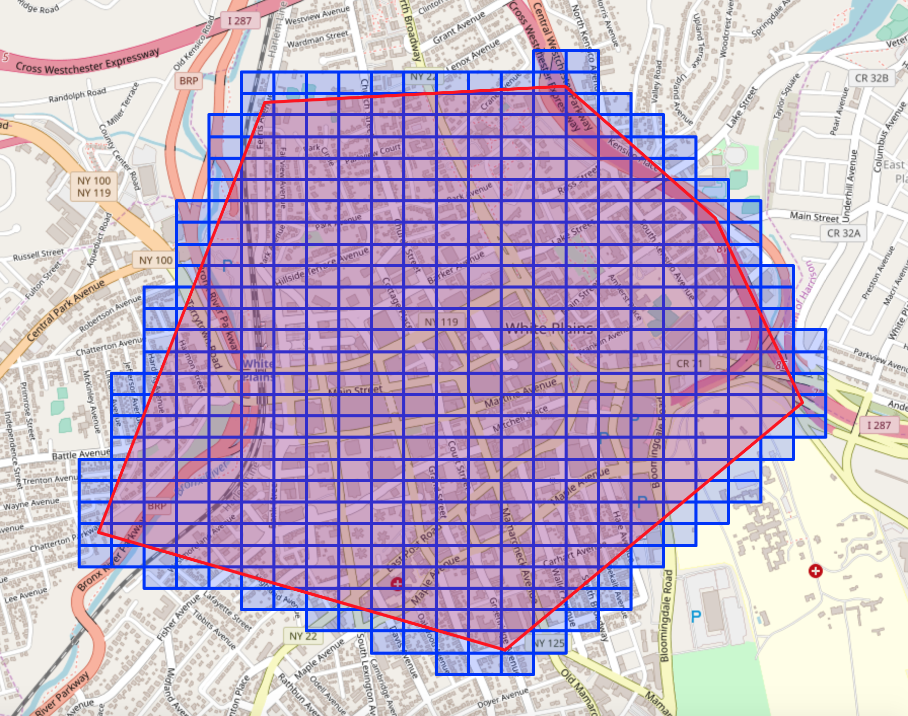
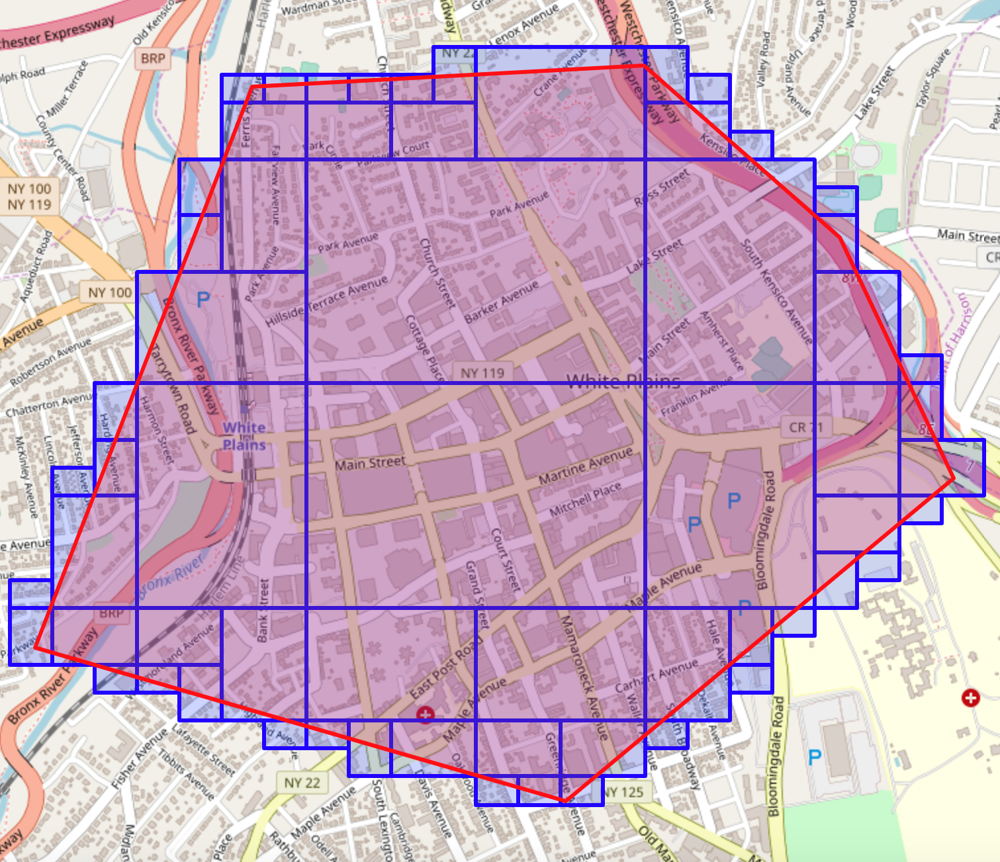

---

copyright:
  years: 2017, 2020
lastupdated: "2020-01-08"

subcollection: AnalyticsEngine

---

<!-- Attribute definitions -->
{:new_window: target="_blank"}
{:shortdesc: .shortdesc}
{:codeblock: .codeblock}
{:screen: .screen}
{:pre: .pre}

# Geohashing functions
{: #geohashing-functions}

The spatio-temporal library includes geohashing functions for proximity search (encoding latitude and longitude and grouping nearby points) in location data analysis.

## Geohash encoding

- Encode a Point object with a geographic location to a base-32 encoded string of letters or digits:
    ```
    >>> p = stc.point(37, -74)
    >>> stc.geohash.string_hash_encode(p)
    'dqe6kpdue5btnubpm9npcd0000'
    >>> stc.geohash.string_hash_encode(p, precision=5)
    'dqe6k'
    ```
- Encode a Point object with a geographic location to a BitVector:
    ```
    >>> p = stc.point(37, -74)
    >>> bv = stc.geohash.number_hash_encode(p)
    >>> bv
    BitVector(01100101100110100110100101010101100110100110100101010101100110100110100101010101100110100110100101010101101100000000000000000000)
    >>> bv.truncate(10)
    >>> bv
    BitVector(0110010110)
    ```
- Encode a pair of latitude and longitude coordinates directly to a geohash:
    ```
    >>> stc.geohash.encode(37, -74, precision=5, mode='base32')
    'dqe6k'
    >>> stc.geohash.encode(37, -74, precision=10, mode='bit')
    '0110010110'
    ```

## Geohash decoding

- Decode geographic base 32 digits or a string to a Point object with the decimal longitude or latitude coordinates:
    ```
    >>> stc.geohash.string_hash_decode('dqeh4')
    Point(37.265625, -74.443359375)
    ```
- Decode base-32 encoded characters to a Point object:
    ```
    >>> p = stc.point(37, -74)
    >>> bv = geohash.number_hash_encode(p)
    >>> geohash.number_hash_decode(bv)
    Point(37.0, -74.0)
    ```
- Decode a base-32 or binary string to a pair of latitude and longitude coordinates:
    ```
    >>> stc.geohash.decode('dqe6k', mode='base32')
    (36.9580078125, -74.00390625)
    >>> stc.geohash.decode('0110010110', mode='bit')
    (33.75, -78.75)
    ```

## Geohash neighbors
The geohash neighbors function returns the neighboring geohash codes around a specified code.

### Geohash neighbors for a point
- Get the geohash neighbors for the given latitude, longitude and bit_depth:
    ```
    >>> stc.geohash.get_all_neighbors(70, -40, 25)
    [BitVector(0111110000001111100101010),
     BitVector(0111110000001111100101011),
     BitVector(0111110000001111100101110),
     BitVector(0111110000001111110000000),
     BitVector(0111110000001111110000001),
     BitVector(0111110000001111110000100),
     BitVector(0111110000001111110000010),
     BitVector(0111110000001111110000011),
     BitVector(0111110000001111110000110)]
    ```

- Get the geohash neighbors for a given latitude, longitude and bit_depth, and only return the results that are within a given distance:
    ```
    >>>geohash.get_all_neighbors(70, -40, 25, distance_precision=1000)
    [BitVector(0111110000001111110000001),
     BitVector(0111110000001111110000100),
     BitVector(0111110000001111110000011),
     BitVector(0111110000001111110000110)]
    ```

### Geohash neighboring functions

- `expand`: Returns the center code and its neighbors. All 9 geohashes for a location are returned:
    ```
    >>> stc.geohash.expand('ezs42')
    ['ezefp', 'ezs40', 'ezs41', 'ezefr', 'ezs42', 'ezs43', 'ezefx', 'ezs48', 'ezs49']
    ```
- `neighbors`: Returns 8 geohashes, excluding the given geohash itself:
    ```
    >>> stc.geohash.neighbors('ezs42')
    ['ezefp', 'ezs40', 'ezs41', 'ezefr', 'ezs43', 'ezefx', 'ezs48', 'ezs49']
    ```
- `get_east`, `get_west`, `get_north`, `get_south`: Returns the east, west, north, or south geohash for a given geohash:
    ```
    >>> stc.geohash.get_east('ezs42')
    'ezs43'
    ```
- Encode a geohash to a `BitVector`:
    ```
    >>> bv = geohash.number_hash_encode(p)
    >>> bv.truncate(25)
    >>> stc.geohash.expand(bv)
    [BitVector(0110010110011010011000101),
     BitVector(0110010110011010011010000),
     BitVector(0110010110011010011010001),
     BitVector(0110010110011010011000111),
     BitVector(0110010110011010011010010),
     BitVector(0110010110011010011010011),
     BitVector(0110010110011010011001101),
     BitVector(0110010110011010011011000),
     BitVector(0110010110011010011011001)]
    >>> stc.geohash.neighbors(bv)
    [BitVector(0110010110011010011000101),
     BitVector(0110010110011010011010000),
     BitVector(0110010110011010011010001),
     BitVector(0110010110011010011000111),
     BitVector(0110010110011010011010011),
     BitVector(0110010110011010011001101),
     BitVector(0110010110011010011011000),
     BitVector(0110010110011010011011001)]
    >>> stc.geohash.get_north(bv)
    BitVector(0110010110011010011011000)
    ```

## Geohash coverage

To calculate a set of geohashes that wholly covers the bounding box:

1. Prepare a sample polygon:
    ```
    test_wkt = 'POLYGON((-73.76223024988917 41.04173285255264,-73.7749331917837 41.04121496082817,-73.78197130823878 41.02748934524744,-73.76476225519923 41.023733725449326,-73.75218805933741 41.031633228865495,-73.7558787789419 41.03752486433286,-73.76223024988917 41.04173285255264))'
    poly = wkt_reader.read(test_wkt)
    ```
2. Compute the geohash cover at a fixed bit depth for a given geometry:
    ```
    cover = stc.geohash.geohash_cover_at_bit_depth(poly, 36)
    ```
    

3. Compute the buffered geohash cover at a fixed bit depth for a given geometry:
    ```
    buffered_cover = stc.geohash.geohash_cover_at_bit_depth(poly, 36, distance=50)
    ```
    

4. Compute a compact geohash cover by computing the fixed depth cover first and then compressing the cover:
    ```
    raw_cover = stc.geohash.geohash_cover_at_bit_depth(poly, 36)
    compact_cover = stc.geohash.geohash_compression(raw_cover)
    ```
    
