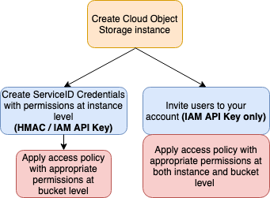

---

copyright:
  years: 2017, 2019
lastupdated: "2019-07-22"

subcollection: AnalyticsEngine

---

<!-- Attribute definitions -->
{:new_window: target="_blank"}
{:shortdesc: .shortdesc}
{:codeblock: .codeblock}
{:screen: .screen}
{:pre: .pre}

# Getting the {{site.data.keyword.cos_short}} credentials
{: #get-cos-credentials}

To work with {{site.data.keyword.cos_short}} in  {{site.data.keyword.iae_full_notm}}, you need the {{site.data.keyword.cos_short}} credentials which can be the:

- **API key**: The IAM API key and the {{site.data.keyword.cos_short}} service endpoint
- **HMAC keys**: The access key, secret key and the {{site.data.keyword.cos_short}} service endpoint


## Access management in {{site.data.keyword.cos_short}}

To securely authenticate to {{site.data.keyword.cos_short}}, you need to understand the concepts of Identity and Access Management (IAM), and how and when to use service credentials and API Keys in the context of {{site.data.keyword.cos_short}}. As the service administrator, IAM offers you flexibility and fine-grained access control to a service instance and it's resources both for direct platform access and service API calls. See [IAM overview](/docs/services/cloud-object-storage/iam?topic=cloud-object-storage-iam-overview).

The following diagram illustrates access management to {{site.data.keyword.cos_short}}.



As the {{site.data.keyword.cos_short}} administrator, you can:

- [Create service IDs](#creating-a-service-id)
- [Invite users and grant permissions](#inviting-users-and-granting-permissions)

## Creating service IDs

When you create service IDs to access an  {{site.data.keyword.cos_short}} service instance, the IDs are  {{site.data.keyword.cos_short}} service IDs and not IDs tied to a user.

As system administrator, you can:

- Create service IDs with access rights at *instance level*

 You determine the degree of access to *all* {{site.data.keyword.cos_short}} buckets in the instance by assigning a service access role to the credential. This can be *Reader*, *Writer* or *Manager* role. If needed, you can create several service IDs for the same instance with different access roles. See [Creating a service ID at instance level](/docs/services/cloud-object-storage/iam?topic=cloud-object-storage-service-credentials).
- Create service IDs with access rights at *bucket level*

 You specify the {{site.data.keyword.cos_short}} buckets in the instance that can be accessed by the service ID. Here too, if needed, you can create several service IDs with access rights to different buckets. See [Creating a service ID at  bucket level](/docs/services/cloud-object-storage/iam?topic=cloud-object-storage-iam-bucket-permissions#iam-service-id).

### Sharing service IDs

The service ID credentials can readily be used by one user. However, if the {{site.data.keyword.cos_short}} instance needs to be shared by more than one users, you as the {{site.data.keyword.cos_short}} service administrator can:

- Share the service ID credentials with other users
- Share the {{site.data.keyword.cos_short}} instance itself (at platform level) with other users, enabling these users to see the credentials for themselves

### Structure of service IDS

When you, as user of {{site.data.keyword.cos_short}}, view the service ID credentials of a provisioned service, you will see something like what is shown in the following example:
```
{
  "apikey": "asdf1234...",
  "cos_hmac_keys": {
    "access_key_id": "a1b2c3...",
    "secret_access_key": "ZYX31..."
  },
  "endpoints": ...
}
```

To configure {{site.data.keyword.iae_full_notm}} to work with {{site.data.keyword.cos_short}}, you need the API key or the HMAC keys. See [API key versus HMAC keys](/docs/services/cloud-object-storage/iam?topic=cloud-object-storage-service-credentials#service-credentials-iam-hmac).

### Service endpoints

As a user of {{site.data.keyword.cos_short}}, you not only need to know the API key or the HMAC keys to configure {{site.data.keyword.cos_short}}, but also the {{site.data.keyword.iae_full_notm}} service endpoints to connect to {{site.data.keyword.cos_short}}. See [Selecting regions and endpoints](/docs/infrastructure/cloud-object-storage-infrastructure?topic=cloud-object-storage-infrastructure-select-regions-and-endpoints) for help on which endpoints to use based on your {{site.data.keyword.cos_short}} bucket type, such as regional versus cross-regional.

You can also view the endpoints across regions for your {{site.data.keyword.cos_short}} service by selecting the service on your {{site.data.keyword.Bluemix_short}} dashboard and clicking **Endpoint** in the navigation pane. Always **choose the private endpoint**. Using the public endpoint is slower and more expensive. An example of an endpoint for US-South Cross region is:
`s3.private.us.cloud-object-storage.appdomain.cloud`

## Inviting users and granting permissions

If you, as {{site.data.keyword.cos_short}} administrator, do not want to create and share the service credentials, you can invite users to your {{site.data.keyword.cos_short}} account and grant them permissions by using access policies on {{site.data.keyword.cos_short}} buckets. The invited users access your account by using their {{site.data.keyword.Bluemix_short}} API keys. See [Assigning access to user groups](/docs/iam?topic=iam-getstarted#group_access).

### Structure of the API key

When you, as user of {{site.data.keyword.cos_short}}, view an  API key in {{site.data.keyword.Bluemix_short}}, you will notice that it has the following structure:
```
{
	"name": "MyAPIKey",
	"description": "",
	"createdAt": "2019-07...",
	"apiKey": "lipsum999..."
}
```

If you need an API key to use with {{site.data.keyword.cos_short}}, see [Creating an API key](/docs/iam?topic=iam-userapikey#create_user_key).

**Remember**: Make a note of this API key and the service endpoints, which you determined in the previous section, for when you configure {{site.data.keyword.iae_full_notm}} to work with {{site.data.keyword.cos_short}}.

## Summary

The following table summarizes the access methods to the {{site.data.keyword.cos_short}} service and the actions supported by the access types.

| Action | Type: Service ID | Type: API key     |
|------|------------------|--------------------|
| Create credentials | Service administrator | Service users |
| Grant access permissions | Service administrator | Service administrator |
| Select credential type | HMAC and IAM API keys | IAM API key only |
| Control access for user roles and data buckets | Yes| Yes|
{: caption="{{site.data.keyword.cos_short}} access methods" caption-side="top"}
