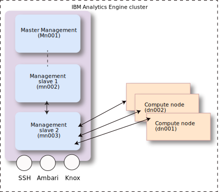

---

copyright:
  years: 2017, 2021
lastupdated: "2021-08-02"

subcollection: AnalyticsEngine

---

<!-- Attribute definitions -->
{:new_window: target="_blank"}
{:shortdesc: .shortdesc}
{:codeblock: .codeblock}
{:screen: .screen}
{:note: .note}
{:pre: .pre}
{:external: target="_blank" .external}

#  Architecture and concepts in classic instances
{: #IAE-overview}

With {{site.data.keyword.iae_full_notm}} you can create Apache Spark and Apache Hadoop clusters in minutes and customize these clusters by using scripts. You can work with data in IBM Cloud Object Storage, as well as integrate other IBM Watson services like {{site.data.keyword.DSX_short}} and Machine Learning.

You can define clusters based on your application's requirements,  choosing the appropriate software pack, version and size of the clusters.

You can deploy {{site.data.keyword.iae_full_notm}} service instances in the following regions: US South, US East, United Kingdom, Germany, Australia and Japan. The {{site.data.keyword.iae_full_notm}} service is deployed in a data center which is physically located in the chosen region.

- [Cluster architecture](#cluster-architecture)
- [Outbound and inbound access](#outbound-and-inbound-access)
- [Software packages](#software-packages)
- [Software components of the cluster](#software-components-of-the-cluster)
- [Hardware configuration](#hardware-configuration)
- [Operating system](#operating-system)
- [Best practices when creating clusters](/docs/AnalyticsEngine?topic=AnalyticsEngine-best-practices)

## Cluster architecture

A cluster consists of a management instance and one or more compute instances. The management instance consists of three management nodes that run in the instance. Each compute and task node runs in a separate compute instance.

You are billed only at the instance level. For more details on billing, see [{{site.data.keyword.iae_full_notm}} Pricing](https://www.ibm.com/cloud/analytics-engine/pricing){: external}.
{: note}

### Management nodes

The three management nodes include:
- management1 node (`mn001`)
- management2 node (`mn002`)
- management3 node (`mn003`)

Ambari and all of the Hadoop and Spark components of the cluster run on the management nodes. To find out which components run on which of the management nodes, click the **hosts** link on the upper right corner of the Ambari UI. Drill down further to get to the listing of the components running on each node.

### Compute nodes

Compute nodes are where the execution of jobs happens. In addition to job execution, compute nodes also runs HDFS which is used by cluster components like Yarn, Hive, and Spark to share the state of an application across the cluster. You define the number of compute nodes at the time the cluster is created; you can also scale up the compute node by using the cluster resize operation. It is required that each cluster has at least one compute node. Each compute nodes is designated as `dn001`, `dn002`, and so on.

### Task nodes

Task nodes are where only the execution of jobs happens. Task nodes don't run HDFS, they rely on HDFS running on cluster's compute nodes for the shared application state. Due to their stateless nature, task nodes are more elastic, that is, the addition and removal of task nodes to a cluster is less error-prone and swift. You can define the number of task nodes at the time the cluster is created; you can also scale up and scale down the task nodes later using the cluster resize operation. It is not mandatory to have task nodes in the cluster; you can have a cluster with no task nodes. Each task nodes is designated as `tn001`, `tn002`, and so on.

Task nodes are only supported on clusters created on or after March 22, 2021.
{: note}

### Summary of cluster nodes

The following cluster nodes exist:

- `mn001`: management1 node
- `mn002`: management2 node
- `mn003`: management3 node
- `dn001`: compute node 1
- `dn002`: compute node 2
- `tn001`: task node 1
- `tn002`: task node 2

## Outbound and inbound access

Cluster services are made available through various endpoints as described in  [Retrieving service endpoints](/docs/AnalyticsEngine?topic=AnalyticsEngine-retrieve-endpoints){: new_window}.

From the endpoint list, you can see that the following ports are open for inbound traffic:

-	`9443`: This is the Admin port.

 The Ambari UI console and APIs are exposed on port 9443 (`https://xxxxx-mn001.<region>.ae.appdomain.cloud:9443`).
-	`8443`: cluster services like Hive, Spark, Livy, Phoenix, and so on are made available for programmatic consumption through the Knox gateway on port 8443

-	`22`: The cluster itself is accessible via SSH through the  standard port `22`.

 When you SSH to a cluster, as described in [Connecting using SSH](/docs/AnalyticsEngine?topic=AnalyticsEngine-connect-SSH)){: new_window}, you essentially log in to `mn003`. Once you have logged in to `mn003`, you can SSH to the compute nodes (referred to as `dn001`, `dn002`, and so on) and to `mn002`.

For example, to log in to a cluster in the US-South region, as given in the endpoint listing, enter:
```
ssh clsadmin@chs-tnu-499-mn003.us-south.ae.appdomain.cloud
```

Once you are on `mn003`, enter the following to log in to `mn002`:
```
ssh clsadmin@chs-tnu-499-mn002
```

and to log in to `dn001` enter:

```
ssh clsadmin@chs-tnu-499-dn001
```

**Note**:
- You can't SSH to the management1 node `mn001`.
- You can SSH to the compute nodes only from within other nodes of the cluster.
- Outbound traffic is open from all nodes.



## Software packages

The following software packages are available when you create a cluster based on Hortonworks Data Platform (HDP) 3.1:

| AE 1.2       | Based on HDP 3.1        |
|-----------------|-----------------------------|
| `AE 1.2 Hive LLAP`  | Hadoop, Livy, Knox, Ambari, <br>Conda-Py, Hive (LLAP mode) |
| `AE 1.2 Spark and Hive` | Hadoop, Livy, Knox, Spark, JEG, Ambari, <br>Conda Py, Hive (non LLAP mode ) |
| `AE 1.2 Spark and Hadoop` | (AE 1.2 Spark and Hive) +  HBase, Phoenix, <br>Oozie |

**Important:**

1. You can no longer provision new instances of {{site.data.keyword.iae_full_notm}} using the `AE 1.1` software packages (based on HDP 2.6.5).
2. Currently you cannot resize a cluster that uses the `AE 1.2 Hive LLAP` software package.

## Software components of the cluster
You can create a cluster based on Hortonworks Data Platform 3.1. The following software components are available for HDP 3.1. Refer to the previous section which lists the software packages to find out which components are available in the provided software packages.   

|  AE 1.2 (HDP 3.1)
|---------------------|
|  Apache Spark 2.3.2 |
|  Hadoop 3.1.1|
|  Apache Livy 0.5|
|  Knox 1.0.0|
|  Ambari 2.7.5|
|  Miniconda with Python 3.7.9 |
|  Jupyter Enterprise Gateway 0.8.0
|  HBase 2.1.6 |
|  Hive 3.1.0 |
|  Hive LLAP 3.1.0 |
|  Oozie 4.3.1 |
|  Tez 0.9.1 |
|  ZooKeeper 3.4.6 |
|  Pig 0.16.0 |
|  Sqoop 1.4.7 |
|  Apache Phoenix 5.0.0 |
|  YARN 3.1.1 |
|  MapReduce2 3.1.1 |

## Hardware configuration

{{site.data.keyword.iae_full_notm}} supports two node sizes for spinning up clusters.

**Size: Default Node**

| Node Type | vCPU | Memory | HDFS Disks |
|---------|------------|-----------|-----------|
| Management node | 4| 16 GB | NA |
| Data node | 4| 16 GB | 2 x 300 GB |

**Size: Memory Intensive Node**

| Node Type | vCPU | Memory | HDFS Disks |
|---------|------------|-----------|-----------|
| Management node | 32| 128 GB | NA |
| Data node | 32| 128 GB | 3 x 300 GB |

## Operating System
The operating system used is Cent OS 7.
