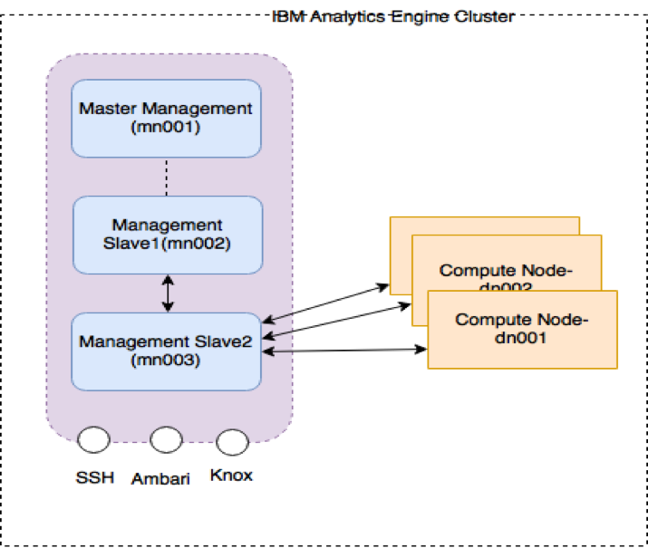

---

copyright:
  years: 2017, 2019
lastupdated: "2018-11-14"

---

<!-- Attribute definitions -->
{:new_window: target="_blank"}
{:shortdesc: .shortdesc}
{:codeblock: .codeblock}
{:screen: .screen}
{:pre: .pre}

# Analytics Engine overview
{: #IAE-overview}

With {{site.data.keyword.iae_full_notm}} you can create Apache Spark and Apache Hadoop clusters in minutes and customize these clusters by using scripts. You can work with data in IBM Cloud Object Storage, as well as integrate other IBM Watson services like {{site.data.keyword.DSX_short}} and Machine Learning.

You can define clusters based on your application's requirements,  choosing the appropriate software pack, version and size of the clusters.

You can deploy {{site.data.keyword.iae_full_notm}} service instances in the US South or United Kingdom regions. The {{site.data.keyword.iae_full_notm}} service is deployed in a data centre which is physically located in the chosen region.

- [Cluster architecture](#cluster-architecture)
- [Outbound and inbound access](#outbound-and-inbound-access)
- [Software components of the cluster](#software-components-of-the-cluster)
- [Hardware configuration](#hardware-configuration)
- [Operating system](#operating-system)
- [Best practices when creating clusters](/docs/services/AnalyticsEngine?topic=AnalyticsEngine-best-practices)

## Cluster architecture

A cluster consists of a management instance and one or more compute instances. The management instance itself consists of three management nodes, which run in the management instance. Each of the compute nodes runs in a separate compute instance.

Note: You are billed only at the instance level. For more details on billing, see [{{site.data.keyword.iae_full_notm}}   Pricing](https://www.ibm.com/cloud/analytics-engine/pricing).

### Management nodes

The three management nodes include:
- The master management node (`mn001`)
- Two management slave nodes (`mn002` and `mn003`).

Ambari and all of the Hadoop and Spark components of the cluster run on the management nodes. To find out which components run on which of the management nodes, click the **hosts** link on the upper right corner of the Ambari UI. Drill down further to get to the listing of the components running on each node.

### Compute nodes

Compute nodes are where the execution of jobs happens. You define the number of compute nodes at the time of cluster creation. Each of the compute nodes is designated as `dn001`, `dn002` and so on.

### Summary of cluster nodes

The following cluster nodes exist:

- `mn001`: master management node
- `mn002`: management slave 1
- `mn003`: management slave 2
- `dn001`: compute node 1
- `dn002`: compute node 2

## Outbound and inbound access

Cluster services are made available through various endpoints as described in this [section](/docs/services/AnalyticsEngine?topic=AnalyticsEngine-retrieve-credentials).

From the endpoint list, you can see that the following ports are open for inbound traffic:

-	**9443**: this is the Admin port.

 The Ambari UI console and APIs are exposed at port 9443 (`https://xxxxx-mn001.<region>.ae.appdomain.cloud:9443`).
-	**8443**: cluster services like Hive, Spark, Livy, Phoenix, and so on are made available for programmatic consumption through the Knox gateway on port 8443

-	**22**: the cluster itself is accessible via SSH at standard port 22.

 When you SSH to a cluster (as described [here](/docs/services/AnalyticsEngine?topic=AnalyticsEngine-connect-SSH)) you essentially log in to `mn003`. Once you have logged in to `mn003`, you can SSH to the compute nodes (referred to as `dn001`, `dn002` etc) and to `mn002`.

For example, to log in to a cluster in the US-South region, as given in the endpoint listing, enter:
```
ssh clsadmin@chs-tnu-499-mn003.us-south.ae.appdomain.cloud
```

Once you are on `mn003`, enter the following to log in to `mn002`:
```
ssh clsadmin@chs-tnu-499-mn002```

and to log in to `dn001` enter:

```
ssh clsadmin@chs-tnu-499-dn001```

**Note:**
- You can't SSH to the master management node `mn001`.
- You can SSH to the compute nodes only from within other nodes of the cluster.
- Outbound traffic is open from all nodes.




## Software components of the cluster
You can create a cluster based on Hortonworks Data Platform 2.6.2 and 2.6.5. The following components are made available.

| HDP 2.6.2       | HDP 2.6.5        |
|---------------------|------------------------|
| Apache Spark 2.1.1 | Apache Spark 2.3.0 |
| Hadoop 2.7.3 | Hadoop 2.7.3|
| Apache Livy 0.3.0 | Apache Livy 0.4|
| Knox 0.12.0 | Knox 0.12.0|
| Ambari 2.5.2 | Ambari 2.6.2|
| Anaconda with Python 2.7.13 and 3.5.2 | Anaconda with Python 2.7.13 and 3.5.2|
| Jupyter Enterprise Gateway 0.8.0 | Jupyter Enterprise Gateway 0.8.0|
| HBase 1.1.2 &#42; | HBase 1.1.2 &#42;|
| Hive 1.2.1 &#42;&#42; | Hive 1.2.1 &#42;&#42;|
| Oozie 4.2.0 &#42; | Oozie 4.2.0 &#42;|
| Flume 1.5.2 &#42; | Flume 1.5.2 &#42;|
| Tez 0.7.0 &#42; | Tez 0.7.0 &#42;|
| Pig 0.16.0 &#42; | Pig 0.16.0 &#42;|
| Sqoop 1.4.6 &#42; | Sqoop 1.4.6 &#42;|
| Slider 0.92.0 &#42; | Slider 0.92.0 &#42;|
| Apache Phoenix 4.7 &#42; | Apache Phoenix 4.7 &#42;|


&#42; Available in the _AE 1.0/1.1 Spark and Hadoop_ pack only <br>
&#42;&#42; Available in the _AE 1.0/1.1 Spark and Hadoop_ and _AE 1.0/1.1 Spark and Hive_ packs only

## Hardware configuration

{{site.data.keyword.iae_full_notm}} supports two node sizes for spinning up clusters.

**Size: Default Node**

| Node Type | vCPU | Memory | HDFS Disks |
|---------|------------|-----------|-----------|
| Master Node | 4| 16 GB | NA |
| Data Node | 4| 16 GB | 2 x 300 GB |

**Size: Memory Intensive Node**

| Node Type | vCPU | Memory | HDFS Disks |
|---------|------------|-----------|-----------|
| Master Node | 32| 128 GB | NA |
| Data Node | 32| 128 GB | 3 x 300 GB |

## Operating System
The operating system used is Cent OS 7.
