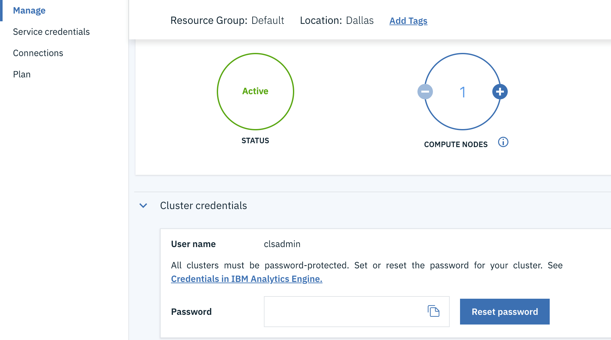

---

copyright:
  years: 2017, 2019
lastupdated: "2019-02-26"

subcollection: AnalyticsEngine

---

# Retrieving cluster credentials
{: #retrieve-cluster-credentials}

Only the {{site.data.keyword.iae_full_notm}} account owner or a user with `Administrator` or `Manager` Identity and Access Management (IAM)  role on the {{site.data.keyword.iae_full_notm}} instance is allowed to retrieve or reset the cluster credentials.

After your {{site.data.keyword.iae_full_notm}} service instance was created, you can get the cluster password in the following ways.

- By invoking the {{site.data.keyword.iae_full_notm}} [`reset_password`](/docs/AnalyticsEngine?topic=AnalyticsEngine-reset-cluster-password#reset-cluster-password) REST API. Calling this API is the only way in which the cluster password is shown to you. You can also use the API to reset the password if you need to.

- By resetting the cluster password on the {{site.data.keyword.iae_full_notm}} service instance page from the {{site.data.keyword.Bluemix_notm}} console.  

  

**Important:** The method of getting the cluster credentials by creating service keys is being deprecated. The service credentials will no longer show the cluster credentials. The service credentials will only include the service endpoints and a role-linked API key for using the {{site.data.keyword.iae_full_notm}} REST API.  
