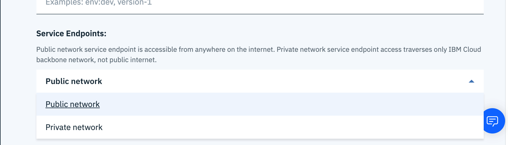

---

copyright:
  years: 2017, 2021
lastupdated: "2021-01-07"

subcollection: AnalyticsEngine

---

<!-- Attribute definitions -->
{:new_window: target="_blank"}
{:shortdesc: .shortdesc}
{:codeblock: .codeblock}
{:screen: .screen}
{:pre: .pre}
{:external: target="_blank" .external}

# Cloud service endpoints integration
{: #service-endpoint-integration}

{{site.data.keyword.Bluemix_notm}} provides connectivity options for accessing cloud services in a secure manner using service endpoints. See [{{site.data.keyword.Bluemix_notm}} service endpoints](/docs/account?topic=account-vrf-service-endpoint).  

When you provision an {{site.data.keyword.iae_full_notm}} instance, you can choose if you want to access your {{site.data.keyword.iae_full_notm}} service through the public internet, which is the default setting, or over the {{site.data.keyword.Bluemix_notm}} private network.

## Public network endpoints
{: #public-endpoints}

Public network endpoints provide connections to your {{site.data.keyword.iae_full_notm}} Apache Spark and Hadoop clusters on the public network. Your environment needs to have internet access to connect to the clusters.

## Private network endpoints
{: #private-endpoints}

Private network endpoints provide connections to your {{site.data.keyword.iae_full_notm}} service over the {{site.data.keyword.Bluemix_notm}} private network. After you have configured your {{site.data.keyword.iae_full_notm}} service to use private endpoints, it is not accessible from the public  internet.   

## Using {{site.data.keyword.Bluemix_notm}} service endpoints
{: #use-service-endpoints}

If you want to enable private network endpoints on your clusters, you need to [enable your account for using {{site.data.keyword.Bluemix_notm}} service endpoints using the {{site.data.keyword.Bluemix_notm}} CLI](/docs/account?topic=account-vrf-service-endpoint#service-endpoint-cli), and then provision a {{site.data.keyword.iae_full_notm}} service instance with private endpoints.

## Provisioning with service endpoints
{: #provision-with-endpoints}

You can provision an {{site.data.keyword.iae_full_notm}} service instance with service endpoints by using one of the following methods:

- {{site.data.keyword.Bluemix_notm}} UI

  To configure the endpoints of your {{site.data.keyword.iae_full_notm}} service instance, use the **Endpoints** field on the {{site.data.keyword.Bluemix_notm}} catalog page. Select to configure either a **Public** or **Private** network.

  

- {{site.data.keyword.Bluemix_notm}} CLI

  If you provision an {{site.data.keyword.iae_full_notm}} service instance by using the {{site.data.keyword.Bluemix_notm}} CLI,  use the command-line option `service-endpoints` to configure the {{site.data.keyword.iae_full_notm}} endpoints. You can specify the value `public` or `private`:
  ```
  ibmcloud resource service-instance-create <service instance name> ibmanalyticsengine <plan_name> <region> -p @<path_to_JSON_file_with_cluster_parameters> --service-endpoints <private/public>
  ```
  {: codeblock}

  Note that `public` is the default value.

  For more information on provisioning using CLI, see [Provisioning an {{site.data.keyword.iae_full_notm}} service instance using the IBM Cloud CLI](/docs/AnalyticsEngine?topic=AnalyticsEngine-provisioning-IAE#creating-a-service-instance-using-the-ibm-cloud-command-line-interface).

- If you provision an {{site.data.keyword.iae_full_notm}} service instance by using the Resource Controller API, specify the service-endpoints in the `parameters` section of the request payload.
  ```
  {
    "name": "<instance name>",
    "resource_plan_id": "<plan id>",
    "resource_group_id": "<resource group id>",
    "region_id": "<region id>",
    "parameters": {
        "hardware_config": "default",
        "num_compute_nodes": "1",
        "software_package": "ae-1.2-hive-spark",
        "service-endpoints": "<private/public>"
      }    
  }
  ```
  {: codeblock}

  For more information on provisioning using REST API, see [Provisioning an {{site.data.keyword.iae_full_notm}} service instance using API](/docs/AnalyticsEngine?topic=AnalyticsEngine-provisioning-IAE#creating-a-service-instance-using-the-resource-controller-rest-api).


  Note that you can enable either public or private network endpoints for your {{site.data.keyword.iae_full_notm}} instance, not both. You can't change this after the {{site.data.keyword.iae_full_notm}} instance was provisioned.

## Service credentials
{: #service-creds}

The service credentials of your {{site.data.keyword.iae_full_notm}} service instance will include the service endpoints of the type that you specified when you provisioned the service instance.

Here are some examples of endpoints:

- Private endpoint for accessing the cluster Ambari UI:
```
https://chs-xti-716-mn001.private.us-south.ae.appdomain.cloud:9443
```
- Livy private endpoint for submitting Spark jobs on the cluster:
```
https://chs-xti-716-mn001.private.us-south.ae.appdomain.cloud:8443/gateway/default/livy/v1/batches
```
- You can also use the private endpoint to access the cluster management APIs. For example:
```
https://api.private.us-south.ae.cloud.ibm.com/v2/analytics_engines/118df864-5041-4770-87f7-3228df1915f3
```

## Accessing a cluster by using an allowlist
{: #cluster-access}

You can use an allowlist to approve user access to and from  {{site.data.keyword.iae_full_notm}} clusters. See [Using an allowlist to control network traffic](/docs/AnalyticsEngine?topic=AnalyticsEngine-allowlist-to-cluster-access).
