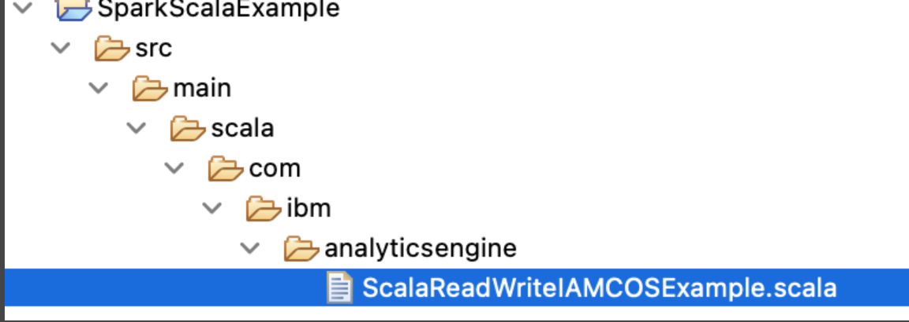

---

copyright:
  years: 2017, 2022
lastupdated: "2022-11-24"

subcollection: analyticsengine

---

<!-- Attribute definitions -->
{:new_window: target="_blank"}
{:shortdesc: .shortdesc}
{:codeblock: .codeblock}
{:screen: .screen}
{:pre: .pre}

# Standard Spark examples
{: #spark-batch-examples}

You can use the following code samples to learn how to use Spark in different situations.


To understand how to access {{site.data.keyword.cos_short}}, see [Understanding the {{site.data.keyword.cos_short}} credentials](/docs/AnalyticsEngine?topic=AnalyticsEngine-cos-credentials-in-iae-serverless).

## Reading a CSV file from {{site.data.keyword.cos_short}} using already stated  credentials

The following code samples show you how to create a Python script that reads data from a CSV file to a Python DataFrame. Both the Python script and the CSV file are located in {{site.data.keyword.cos_short}}.

You can use the same {{site.data.keyword.cos_full_notm}} credentials that you specified at the time you submitted the Spark application or that were set as a default configuration when you created the {{site.data.keyword.iae_full_notm}} service instance to read from {{site.data.keyword.cos_short}} within the application.

Example of the application called `read-employees.py`. Insert the {{site.data.keyword.cos_short}} bucket name and service name. The service name is any name given to your {{site.data.keyword.cos_short}} instance:
```python
from pyspark.sql import SparkSession

def init_spark():
  spark = SparkSession.builder.appName("read-write-cos-test").getOrCreate()
  sc = spark.sparkContext
  return spark,sc

def read_employees(spark,sc):
  print("Hello 1"  , spark )
  employeesDF = spark.read.option("header",True).csv("cos://cosbucketname.cosservicename/employees.csv")
  print("Hello 2" , employeesDF)
  employeesDF.createOrReplaceTempView("empTable")
  seniors = spark.sql("SELECT empTable.NAME FROM empTable WHERE empTable.BAND >= 6")
  print("Hello 3", seniors)
  seniors.show()

def main():
  spark,sc = init_spark()
  read_employees(spark,sc)

if __name__ == '__main__':
  main()
```
{: codeblock}

Example of the CSV file called `employees.csv` that is read by the application called `read-employees.py`:
```text
NAME,BAND,DEPT
Abraham,8,EG
Barack,6,RT
Clinton,5,GG
Hoover,4,FF
Kennedy,7,NN
Truman,3,TT
```
{: codeblock}

To run the application called `read-employees.py` that reads data from `employees.csv` POST the following JSON payload script called `read-employees-submit.json`. Insert the {{site.data.keyword.cos_short}} bucket and service name where the CSV file is located, modify the endpoint path and insert your access key and secret key.
```json
{
  "application_details": {
    "application": "cos://cosbucketname.cosservicename/read-employees.py",
    "conf": {
      "spark.hadoop.fs.cos.cosservicename.endpoint": "https://s3.direct.us-south.cloud-object-storage.appdomain.cloud/<CHANGME-according-to-instance>",
      "spark.hadoop.fs.cos.cosservicename.access.key": "<CHANGEME>",
      "spark.hadoop.fs.cos.cosservicename.secret.key": "<CHANGEME>"
      }
  }
}
```
{: codeblock}

## Reading a CSV file from {{site.data.keyword.cos_short}} using IAM API Key or different HMAC credentials

The following code samples show you how to create a Python script that reads data from a CSV file to a Python DataFrame. Both the Python script and the CSV file are located in {{site.data.keyword.cos_short}}.

This example shows you how to access {{site.data.keyword.cos_full_notm}} using the IAM API key.

Example of the application called `read-employees-iam-key-cos.py`. Insert the {{site.data.keyword.cos_short}} bucket name where the CSV file is located and the modify the endpoint path.
```python
from pyspark.sql import SparkSession

def init_spark():
  spark = SparkSession.builder.appName("read-write-cos-test").getOrCreate()
  sc = spark.sparkContext
  hconf=sc._jsc.hadoopConfiguration()
  hconf.set("fs.cos.testcos.endpoint", "s3.direct.us-south.cloud-object-storage.appdomain.cloud/CHANGEME-according-to-instance="
("fs.cos.testcos.iam.api.key","<CHANGEME>")
  return spark,sc


def read_employees(spark,sc):
  print("Hello1 "  , spark )
  employeesDF = spark.read.option("header",True).csv("cos://cosbucketname.cosservicename/employees.csv")
  print("Hello2" , employeesDF)
  employeesDF.createOrReplaceTempView("empTable")
  juniors = spark.sql("SELECT empTable.NAME FROM empTable WHERE empTable.BAND < 6")
  print("Hello3", juniors)
  juniors.show()


def main():
  spark,sc = init_spark()
  read_employees(spark,sc)


if __name__ == '__main__':
  main()
```
{: codeblock}

Then POST the following payload JSON script called `read-employees-iam-key-cos-submit.json` with your access key and password. Insert the {{site.data.keyword.cos_short}} bucket name where the CSV file is located and the modify the endpoint path.
```json
{
  "application_details": {
    "application": "cos://cosbucketname.cosservicename/read-employees-iam-key-cos.py",
    "conf": {
      "spark.hadoop.fs.cos.cosservicename.endpoint": "https://s3.direct.us-south.cloud-object-storage.appdomain.cloud/CHANGME-according-to-instance",
      "spark.hadoop.fs.cos.cosservicename.access.key": "<CHANGEME>",
      "spark.hadoop.fs.cos.cosservicename.secret.key": "<CHANGEME>"
      }
  }
}
```
{: codeblock}

##  Reading and writing to {{site.data.keyword.cos_short}} using IAM in Scala

1. Create an Eclipse project of the following format:

{: caption="Figure 1. Eclipse project folder structure" caption-side="bottom"}

1. Add the following application called `ScalaReadWriteIAMCOSExample.scala` to the `analyticsengine` folder. Insert your IAM API key and the {{site.data.keyword.cos_short}} bucket name.

    ```scala
    package com.ibm.analyticsengine
    import org.apache.spark.{SparkConf, SparkContext}
    import org.apache.spark.SparkContext._

    object ScalaReadWriteIAMCOSExample {
      def main(args: Array[String]) {
        val sparkConf = new SparkConf().setAppName("Spark Scala Example")
        val sc = new SparkContext(sparkConf)
            val prefix="fs.cos.cosservicename"
            sc.hadoopConfiguration.set(prefix + ".endpoint", "s3.direct.us-south.cloud-object-storage.appdomain.cloud")
            sc.hadoopConfiguration.set(prefix + ".iam.api.key","<CHANGEME>")
            val data = Array("Sweden", "England", "France", "Tokyo")
            val myData = sc.parallelize(data)
            myData.saveAsTextFile("cos://cosbucketname.cosservicename/2021sep25-1.data")
            val myRDD=sc.textFile("cos://cosbucketname.cosservicename/2021sep25-1.data")
            myRDD.collect().foreach(println)
        }
    }
    ```
    {: codeblock}

1. Put `SparkScalaExample.sbt` in the `src` folder:

    ```scala
    name := "ScalaReadWriteIAMCOSExample"

    version := "1.0"

    scalaVersion := "2.12.10"

    libraryDependencies += "org.apache.spark" %% "spark-core" % "3.1.2"
    ```
    {: codeblock}

1. Build the Scala project using sbt. Upload the resultant jar (`scalareadwriteiamcosexample_2.12-1.0.jar`) into {{site.data.keyword.cos_short}}.

    ```sh
    cd SparkScalaExample
    sbt package
    ```
    {: codeblock}

    Upload jar to Object Storage.

1. Then POST the following payload JSON script called `read-write-cos-scala-submit.json` with your access key and password. Insert the {{site.data.keyword.cos_short}} bucket name where the CSV file is located and the modify the endpoint path.

    ```json
    {
      "application_details": {
        "application": "cos://cosbucketname.cosservicename/scalareadwriteiamcosexample_2.12-1.0.jar",
        "class":"com.ibm.analyticsengine.ScalaReadWriteIAMCOSExample",
        "conf": {
          "spark.hadoop.fs.cos.cosservicename.endpoint": "https://s3.direct.us-south.cloud-object-storage.appdomain.cloud-CHANGME-according-to-instance",
          "spark.hadoop.fs.cos.cosservicename.access.key": "<CHANGEME>",
          "spark.hadoop.fs.cos.cosservicename.secret.key": "<CHANGEME>"
          }
        }
    }
    ```
    {: codeblock}


## Submitting application details with IAM API key

The following example show the application details for the application called `read-employees.py` that reads data from `employees.csv` in {{site.data.keyword.cos_short}} using the IAM API key. Insert the {{site.data.keyword.cos_short}} bucket and service name where the CSV file is located and the API key.
```json
{
  "application_details": {
    "application": "cos://cosbucketname.cosservicename/read-employees.py",
    "conf": {
      "spark.hadoop.fs.cos.cosservicename.endpoint": "https://s3.direct.us-south.cloud-object-storage.appdomain.cloud-CHANGME-according-to-instance",
      "spark.hadoop.fs.cos.cosservicename.iam.api.key": "CHANGME"
      }
  }
}
```
{: codeblock}
