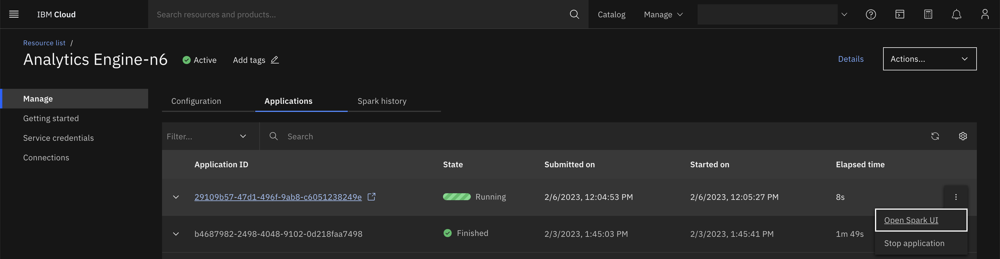

---

copyright:
  years: 2023
lastupdated: "2023-02-07"

subcollection: AnalyticsEngine

---

<!-- Attribute definitions -->
{:new_window: target="_blank"}
{:shortdesc: .shortdesc}
{:note: .note}
{:codeblock: .codeblock}
{:screen: .screen}
{:pre: .pre}
{:external: target="_blank" .external}

# Spark user interface
{: #spark-user-interface}

The Spark user interface (Spark UI) helps you to keep track of various aspects of a running Spark application.

The list below includes a few examples:

* current running stage
* number of tasks in a stage
* reason for a longer running stage
* strangler task in a stage
* whether the executors in the application are used optimally
* inspect into memory and disk consumption of the driver and executors

For details, see the [Spark-UI documentation](https://spark.apache.org/docs/latest/monitoring.html#web-interfaces).

IBM Analytics Engine displays the Spark UI only for the Spark applications that are currently running. You cannot access Spark UI for a completed application.

Use the Spark history server to inspect the run of a completed Spark application. To access the Spark history server, see the [Access Spark history server](https://cloud.ibm.com/docs/AnalyticsEngine?topic=AnalyticsEngine-spark-history-serverless).
{: note}

## Accessing the Spark UI

The Spark UI endpoint of a running Spark application is accessible from the service details page of the IBM Analytics Engine instance.

The following image shows you an example of the Application tab with the link to the Spark UI of a running application.

{: caption="Figure 1. Application tab of IBM Analytics Engine service details page" caption-side="bottom"}

The Spark UI endpoint of the running Spark application can also be obtained by invoking the following IBM Analytics Engine REST API endpoints or corresponding SDK methods:

* [Retrieve the details of a given Spark application](https://cloud.ibm.com/apidocs/ibm-analytics-engine-v3#get-application)

* [List Spark applications](https://cloud.ibm.com/apidocs/ibm-analytics-engine-v3#list-applications)

A sample url template for the Spark UI endpoint is as below:

```
https://spark-console.{REGION}.ae.cloud.ibm.com/v3/analytics_engines/{INSTANCE_ID}/spark_applications/{APPLICATION_ID}/spark_ui
```
{: codeblock}

Parameter values:


* REGION: For applications submitted on an instance in the Dallas region, substitute the REGION with `us-south` and for applications submitted on an instance in the Frankfurt region, substitute the REGION in the endpoint with `eu-de`.
* INSTANCE_ID: Identifier of the IBM Analytics Engine instance under which the application is running.
* APPLICATION_ID: Identifier of the application for which Spark UI is accessed.

## Accessing the Spark UI REST API
In addition to the Web UI, Spark UI APIs are also exposed for programmatic consumption.

For example, enter:

```
curl  "https://spark-console.{REGION}.ae.cloud.ibm.com/v3/analytics_engines/{INSTANCE_ID}/spark_applications/{APPLICATION_ID}/spark_ui_api/v1/applications" --header "Authorization: Bearer {IAM TOKEN}"
```
{: codeblock}

Parameter values:


* REGION: For applications submitted on an instance in the Dallas region, substitute the REGION with `us-south` and for applications submitted on an instance in the Frankfurt region, substitute the REGION in the endpoint with `eu-de`.
* INSTANCE_ID: Identifier of the IBM Analytics Engine instance under which the application is running.
* APPLICATION_ID: Identifier of the application for which Spark UI is accessed.
* IAM TOKEN: Ensure that you have the necessary privileges to access the service instance.

For more details on APIs, see [SparkUI server REST API documentation](https://spark.apache.org/docs/latest/monitoring.html#rest-api).
