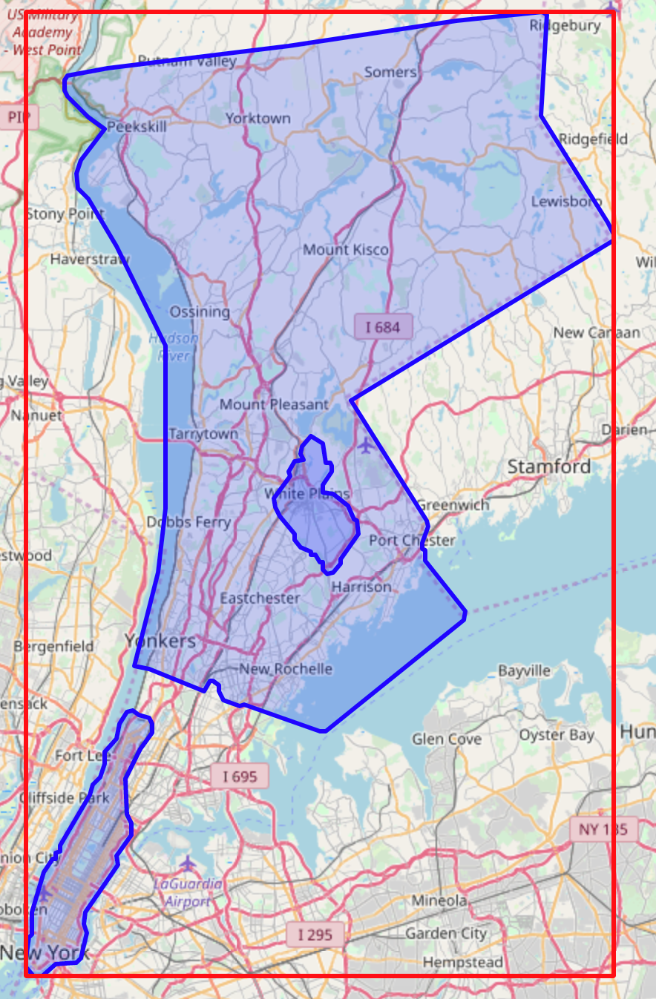
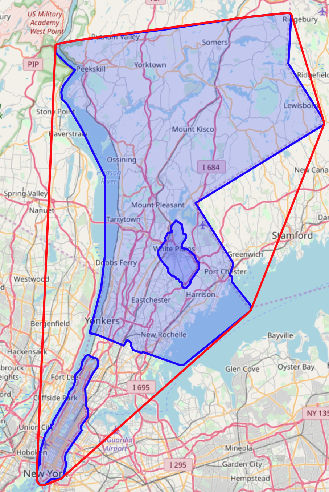

---

copyright:
  years: 2017, 2023
lastupdated: "2023-02-13"

subcollection: AnalyticsEngine

---

<!-- Attribute definitions -->
{:new_window: target="_blank"}
{:shortdesc: .shortdesc}
{:codeblock: .codeblock}
{:screen: .screen}
{:pre: .pre}

# Topological functions
{: #topological-functions}

With the spatio-temporal library, you can use topological relations to confine the returned results of your location data analysis.

The Python code snippets in this topic, which show you how to use the different topological functions, run on test data. Begin by preparing the test data in WKT string format and reading it:
```bash
westchester_WKT = 'POLYGON((-73.984 41.325,-73.948 41.33,-73.78 41.346,-73.625 41.363,-73.545 41.37,-73.541 41.368,-73.547 41.297,-73.485 41.223,-73.479 41.215,-73.479 41.211,-73.493 41.203,-73.509 41.197,-73.623 41.144,-73.628 41.143,-73.632 41.14,-73.722 41.099,-73.714 41.091,-73.701 41.073,-73.68 41.049,-73.68 41.047,-73.673 41.041,-73.672 41.038,-73.668 41.035,-73.652 41.015,-73.651 41.011,-73.656 41,-73.655 40.998,-73.656 40.995,-73.654 40.994,-73.654 40.987,-73.617 40.952,-73.618 40.946,-73.746 40.868,-73.751 40.868,-73.821 40.887,-73.826 40.886,-73.84 40.89,-73.844 40.896,-73.844 40.9,-73.85 40.903,-73.853 40.903,-73.854 40.9,-73.859 40.896,-73.909 40.911,-73.92 40.912,-73.923 40.914,-73.923 40.918,-73.901 40.979,-73.894 41.023,-73.893 41.043,-73.896 41.071,-73.894 41.137,-73.94 41.207,-73.965 41.24,-73.973 41.244,-73.975 41.247,-73.976 41.257,-73.973 41.266,-73.95 41.288,-73.966 41.296,-73.98 41.309,-73.984 41.311,-73.987 41.315,-73.987 41.322,-73.984 41.325))'
white_plains_WKT = 'POLYGON((-73.792 41.024,-73.794 41.031,-73.779 41.046,-73.78 41.049,-73.779 41.052,-73.776 41.054,-73.775 41.057,-73.767 41.058,-73.769 41.062,-73.768 41.067,-73.762 41.073,-73.759 41.074,-73.748 41.069,-73.746 41.056,-73.742 41.056,-73.74 41.053,-73.74 41.049,-73.749 41.04,-73.748 41.035,-73.739 41.034,-73.729 41.029,-73.725 41.025,-73.72 41.016,-73.717 41.015,-73.716 41.006,-73.718 41.002,-73.732 40.988,-73.732 40.985,-73.739 40.979,-73.745 40.978,-73.749 40.981,-73.749 40.986,-73.751 40.986,-73.756 40.991,-73.759 40.991,-73.76 40.993,-73.765 40.994,-73.769 40.997,-73.774 41.002,-73.775 41.006,-73.788 41.018,-73.792 41.024))'
manhattan_WKT = 'POLYGON((-74.023 40.709,-74.02 40.723,-74.018 40.725,-74.019 40.731,-74.016 40.737,-74.017 40.741,-74.014 40.755,-74.011 40.757,-74.011 40.761,-74.006 40.767,-74.006 40.769,-73.998 40.778,-73.996 40.778,-73.995 40.783,-73.991 40.784,-73.991 40.788,-73.98 40.8,-73.966 40.822,-73.964 40.823,-73.961 40.83,-73.957 40.832,-73.954 40.836,-73.951 40.845,-73.951 40.853,-73.947 40.855,-73.94 40.863,-73.936 40.87,-73.936 40.873,-73.93 40.881,-73.924 40.882,-73.919 40.879,-73.909 40.877,-73.906 40.873,-73.907 40.867,-73.912 40.86,-73.918 40.855,-73.931 40.835,-73.93 40.81,-73.925 40.803,-73.925 40.795,-73.939 40.781,-73.938 40.774,-73.968 40.741,-73.969 40.733,-73.967 40.73,-73.967 40.726,-73.969 40.717,-73.973 40.709,-73.977 40.706,-73.996 40.705,-73.999 40.701,-74.008 40.696,-74.016 40.696,-74.017 40.698,-74.019 40.698,-74.023 40.703,-74.023 40.709))'
wkt_reader = stc.wkt_reader()
westchester = wkt_reader.read(westchester_WKT)
white_plains = wkt_reader.read(white_plains_WKT)
manhattan = wkt_reader.read(manhattan_WKT)
```

## Topological relations
{: #topological-functions-6}

You can use the following topological relation functions:

- `contains`: Returns true if the given geometry is completely contained by this geometry. `contains` returns the exact opposite  of `within`.
    ```bash
    >>> westchester.contains(white_plains)
    True
    ```
- `within`: Returns true if the given geometry is completely within this geometry. `within` returns the exact opposite of `contains`.
    ```bash
    >>> white_plains.within(westchester)
    True
    ```
- `intersects`: Returns true if the intersection does not result in an empty set. `intersects` is the opposite of `disjoint`.
    ```bash
    >>> westchester.intersects(manhattan)
    False
    ```
- `disjoint`: Returns true if the intersection of the two geometries is an empty set. `disjoint` is the opposite of `intersects`.
    ```bash
    >>> westchester.disjoint(manhattan)
    True
    ```
- `touch`: Returns true if none of the points common to both geometries intersect the interiors of both geometries. At least one geometry must be a `linestring`, `polygon`, `multilinestring`, or `multipolygon`.
    ```bash
    >>> westchester.touch(manhattan)
    True
    ```
- `overlap`: Compares two geometries of the same dimension and returns true if their intersection set results in a geometry different from both but of the same dimension.
    ```bash
    >>> westchester.overlap(white_plains)
    True
    ```
- `cross`: Returns true if the intersection results in a geometry whose dimension is one less than the maximum dimension of the two source geometries and the intersection set is interior to both source geometries.
    ```bash
    >>> westchester.cross(white_plains)
    False
    ```
- `equality`: Compares two geometry A and B and only returns true if A contains B and B contains A.
    ```bash
    >>> westchester.equality(westchester)
    True
    ```

## Topological operations
{: #topological-functions-1}

You can use the following topological operations:

- `intersection`: Returns the intersection of two geometries.
    ```bash
    >>> westchester.intersection(white_plains)
    Polygon: Boundary: Ring(LineSegment(Point(41.054, -73.776), Point(41.052, -73.779)), LineSegment(Point(41.052, -73.779), Point(41.049, -73.78)), LineSegment(Point(41.049, -73.78), Point(41.046, -73.779)), ...) Interiors:
    >>> westchester.intersection(white_plains).equality(white_plains)
    True
    ```
- `union`: Returns the union of two geometries.
    ```bash
    >>> westchester.union(white_plains)
    Polygon: Boundary: Ring(LineSegment(Point(41.297, -73.547), Point(41.368, -73.541)), LineSegment(Point(41.368, -73.541), Point(41.37, -73.545)), LineSegment(Point(41.37, -73.545), Point(41.363, -73.625)), ...) Interiors:
    >>> westchester.union(white_plains).equality(westchester)
    True
    ```
- `difference`: Returns the difference of two geometries.
    ```bash
    >>> westchester.difference(white_plains)
    Polygon: Boundary: Ring(LineSegment(Point(41.015, -73.717), Point(41.006, -73.716)), LineSegment(Point(41.006, -73.716), Point(41.002, -73.718)), LineSegment(Point(41.002, -73.718), Point(40.988, -73.732)), ...) Interiors: Ring(LineSegment(Point(41.33, -73.948), Point(41.325, -73.984)), LineSegment(Point(41.325, -73.984), Point(41.322, -73.987)), LineSegment(Point(41.322, -73.987), Point(41.315, -73.987)), ...)
    ```
- `symmetric_difference`: Returns the symmetric difference of two geometries.
    ```bash
    >>> westchester.symmetric_difference(white_plains)
    Polygon: Boundary: Ring(LineSegment(Point(41.016, -73.72), Point(41.015, -73.717)), LineSegment(Point(41.015, -73.717), Point(41.006, -73.716)), LineSegment(Point(41.006, -73.716), Point(41.002, -73.718)), ...) Interiors: Ring(LineSegment(Point(40.9, -73.854), Point(40.903, -73.853)), LineSegment(Point(40.903, -73.853), Point(40.903, -73.85)), LineSegment(Point(40.903, -73.85), Point(40.9, -73.844)), ...)
    ```
- `centroid`: Returns the centroid of the geometry.
    ```bash
    >>> westchester.centroid()
    Point(41.15551622739597, -73.7592843233704)
    ```
- `buffer`: Encircles a geometry at a specified distance and returns a geometry that is the buffer that surrounds the source geometry.
    ```bash
    >>> westchester.buffer(10)
    Polygon: Boundary: Ring(LineSegment(Point(40.88992634549079, -73.84008396708809), Point(40.88991528975788, -73.84003963012559)), LineSegment(Point(40.88991528975788, -73.84003963012559), Point(40.88591860374262, -73.82605122467605)), LineSegment(Point(40.88591860374262, -73.82605122467605), Point(40.88590363932323, -73.82601718861555)), ...) Interiors:
    >>> westchester.buffer(10).contains(westchester)
    True
    ```
- `get_bounding_box`: Returns the bounding box of the geometry.
    ```bash
    >>> westchester.get_bounding_box()
    BoundingBox: Lower Corner: Point(40.86800000000001, -73.987), Upper Corner: Point(41.36999999999998, -73.479)
    ```

## Topological metrics
{: #topological-functions-2}

You can use the following function for topological metrics:

- `area` : Returns the area of the geometry.
    ```bash
    >>> white-plains.area()
    17751
    ```
- `distance`: Returns the distance between the two geometries.
    ```bash
    >>> white_plains.distance(manhattan)
    17751
    ```
- `get_topological_dimensionality`: Returns the topological dimensionality of the geometry.
    ```bash
    >>> white_plains.get_topological_dimensionality()
    2
    ```

## Topological aggregation
{: #topological-functions-3}

You can use the following aggregation functions:

- Get the aggregated bounding box for a list of geometries.
    ```bash
    white_plains_bbox = white_plains.get_bounding_box()
    westchester_bbox = westchester.get_bounding_box()
    manhattan_bbox = manhattan.get_bounding_box()
    aggregated_bbox = white_plains_bbox.get_containing_bb(westchester_bbox).get_containing_bb(manhattan_bbox)
    ```

    {: caption="Figure 1. Bounding box for a list of geometries" caption-side="bottom"}

- Get the aggregated convex hull for a list of geometries:
    ```bash
    white_plains_points = white_plains.get_exterior_ring().get_points()
    westchester_points = westchester.get_exterior_ring().get_points()
    manhattan_points = manhattan.get_exterior_ring().get_points()
    all_points = white_plains_points + westchester_points + manhattan_points
    hull = stc.convex_hull.compute_convex_hull(all_points)
    ```

    {: caption="Figure 2. Aggregated convex hull for a list of  geometries" caption-side="bottom"}
