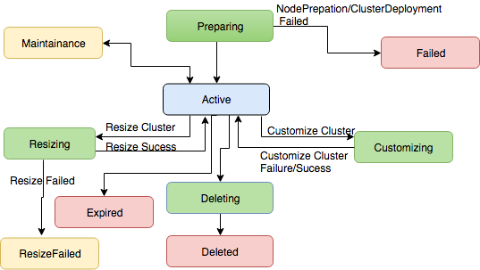

---

copyright:
  years: 2017
lastupdated: "2017-12-14"

---

<!-- Attribute definitions -->
{:new_window: target="_blank"}
{:shortdesc: .shortdesc}
{:codeblock: .codeblock}
{:screen: .screen}
{:pre: .pre}

# Tracking the status of the cluster provisioning

The following diagram illustrates the various states of a cluster during cluster creation, cluster resizing, and cluster deletion.



You can track the status of your cluster provisioning by using the following REST API:

```curl -i -X GET  https://api.dataplatform.ibm.com/v2/analytics_engines/<service_instance_id>/state -H 'Authorization: Bearer <user's IAM access token>'
```  

Expected response: The overall cluster state is returned in JSON format, for example, ` {"state":"Active"}`
