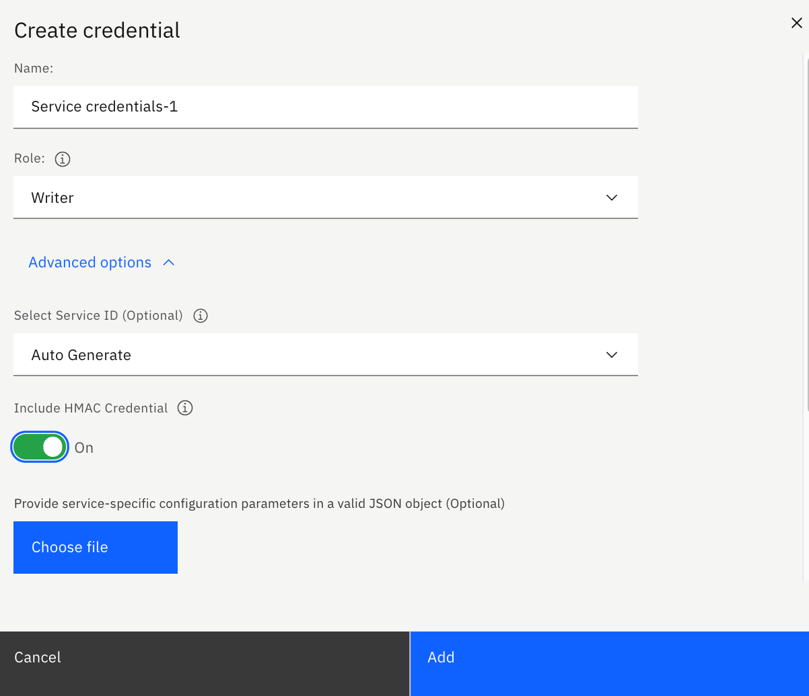

---

copyright:
  years: 2017, 2021
lastupdated: "2021-07-15"

subcollection: analyticsengine

---

<!-- Attribute definitions -->
{:new_window: target="_blank"}
{:shortdesc: .shortdesc}
{:codeblock: .codeblock}
{:screen: .screen}
{:pre: .pre}
{:external: target="_blank" .external}

# Using {{site.data.keyword.cos_short}} as the instance home
{: #cos-serverless}

{{site.data.keyword.cos_full_notm}} is a highly scalable cloud storage service, designed for high durability, resiliency and security. See [{{site.data.keyword.cos_full_notm}}](/docs/cloud-object-storage?topic=cloud-object-storage-about-cloud-object-storage){: external}.

In {{site.data.keyword.iae_full_notm}} serverless instances, {{site.data.keyword.cos_full_notm}} must be used as the service instance home in which custom application libraries and Spark history events are stored.

The instance home can be associated with the {{site.data.keyword.iae_full_notm}} serverless instance:

-	At the time the [instance is created](#define-instance)
-	After the instance was created by using the [`instance_home` API](#using-api)

## Defining {{site.data.keyword.cos_full_notm}} as the instance home
{: #define-instance}

To define {{site.data.keyword.cos_short}} as the instance home for your {{site.data.keyword.iae_full_notm}} serverless instance:

1. Provision an {{site.data.keyword.cos_short}} service instance in {{site.data.keyword.Bluemix_short}}. See [Creating a new service instance](/docs/cloud-object-storage/iam?topic=cloud-object-storage-provision){: external}.
1. After the instance was provisioned, generate service credentials and retrieve the HMAC access key ID.
1. Use the retrieved credentials to create an instance.

### Getting the {{site.data.keyword.cos_short}} credentials
{: #get-creds-cos}

You need to add the access credentials to the {{site.data.keyword.cos_short}} instance in the JSON payload when you create an {{site.data.keyword.iae_full_notm}} serverless instance and specify the instance home storage for the instance.

To get the {{site.data.keyword.cos_short}} credentials:

1. Select the {{site.data.keyword.cos_short}} instance under Storage from your {{site.data.keyword.Bluemix_short}} resource list.
1. Select **Service credentials** in the navigation pane.
1. Click **New credential** and choose the following options:

  1. Enter a credential name of your choice.
  1. Choose the `Writer` role.
  1. Under **Advanced options**:

    - Choose **Auto Generate** for the Service ID.
    - Turn on the option to include **HMAC credential**.
  1.	Click **Add**.

    

### What are the {{site.data.keyword.cos_short}} credentials
{: #what-are-cos-creds}

To  get the credentials of the {{site.data.keyword.cos_short}} instance you created to reference from your {{site.data.keyword.iae_full_notm}} serverless instance:

1. Select the credential name you created and copy the credentials to the clipboard.
1. View the credentials that you copied. You will see something like what is shown in the following example:
   ```
   {
     "apikey": "XXXXXXX",
     "cos_hmac_keys": {
       "access_key_id": "aaaa1111bbbbb222222ccccc3333333ddddd44444",
       "secret_access_key": "ZZZZYYYYYXXXXXXWWWWWVVVVVVUUUUU"
       },
       "endpoints": ...
   }
   ```

   Note:

   - Currently, the {{site.data.keyword.iae_full_notm}} serverless plan supports HMAC style credentials only.
   - Pick public endpoints for consumption.
   <!--- The endpoint to your {{site.data.keyword.cos_full_notm}} instance should be the `direct` endpoint. You can find the `direct` endpoint to your {{site.data.keyword.cos_full_notm}} instance on the {{site.data.keyword.Bluemix_short}} dashboard by selecting cross regional resiliency, the location, and then clicking on your service instance. You can copy the direct endpoint from the **Endpoints** page.-->

## Associate the instance home using REST API
{: #using-api}

If you did not associate an instance home with your instance at the time you created it, you can associate it after the instance was created by using the following REST API. In the near future, you will also be able to do this through Console UI and CLI.

**Note**: You can associate an instance home only once during the lifetime of the instance.

To associate an instance home:
```
curl -X PUT https://api.<region>.ae.cloud.ibm.com/v3/analytics_engines/<instance-id>/instance_home -d @instance-home.json
```
where `instance-home.json`  has the following format:

```
{
  "instance_id": "CLOUD_OBJECT_STORAGE_INSTANCE_GUID",
  "provider": "ibm-cos",
  "type": "objectstore",
  "region": "REGION_OF_CLOUD_OBJECT_STORAGE_INSTANCE",
  "endpoint": "https://s3.us-south.cloud-object-storage.appdomain.cloud",
  "hmac_access_key": "CLOUD_OBJECT_STORAGE_HMAC_ACCESS_KEY",
  "hmac_secret_key": "LOUD_OBJECT_STORAGE_HMAC_SECRET_KEYE"
}

```
